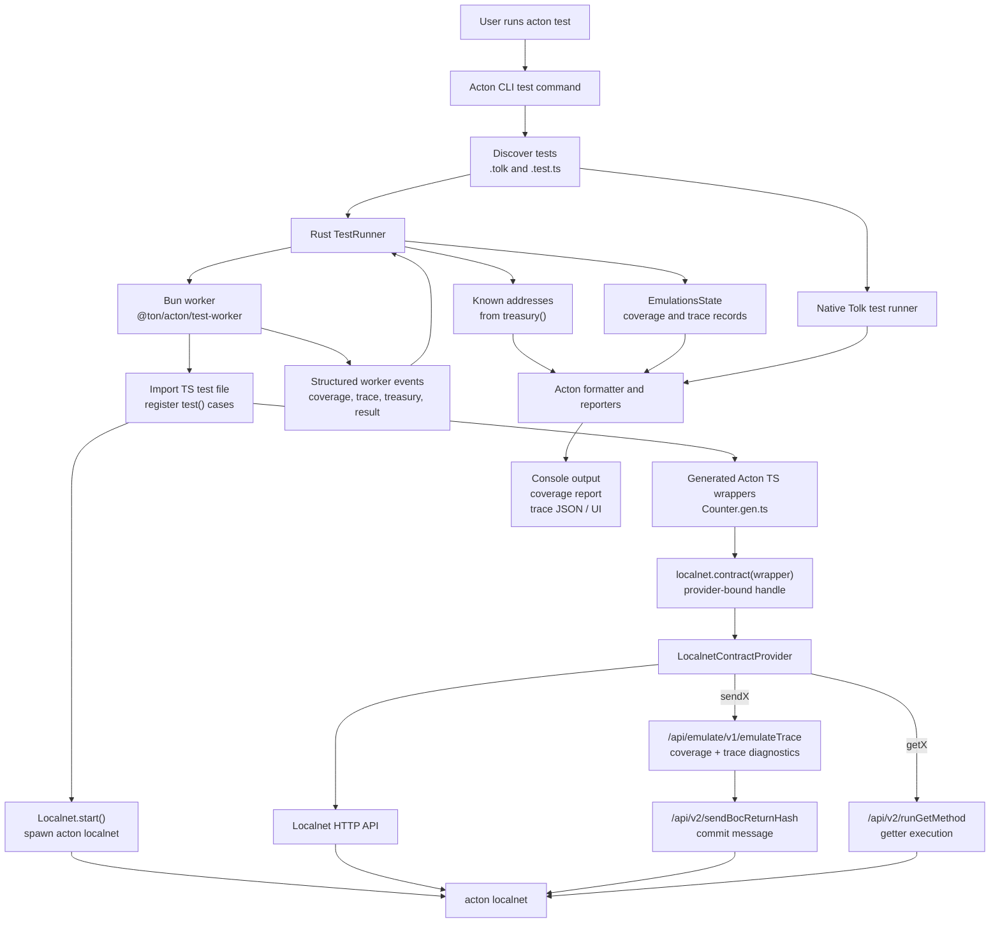

# @ton/acton Architecture

`@ton/acton` keeps TypeScript tests thin. The library starts or connects to `acton localnet`,
uses generated Acton TypeScript wrappers for contract calls, and reports structured events back to
`acton test` so the existing Acton reporter, coverage, trace dump, and UI machinery stay in use.

## Responsibilities

`acton test` owns discovery, contract compilation, reporting, coverage aggregation, trace export,
and UI integration. TypeScript files are just another test source for the same runner.

`@ton/acton/test-worker` is the protocol boundary. It runs TS tests in Bun, snapshots and restores
localnet state between tests, and emits newline-delimited JSON events prefixed with
`__ACTON_NODE_EVENT__`.

`Localnet` is the client-side test facade. It starts `acton localnet`, provides synthetic
`treasury()` senders, binds generated wrapper methods through `contract()`, and collects diagnostics
only when `acton test` enables coverage or trace export.

The TS package does not bundle an emulator. All execution goes through `acton localnet`, which keeps
behavior aligned with the Acton CLI and lets TS tests reuse existing Acton output, coverage, and UI
features.
