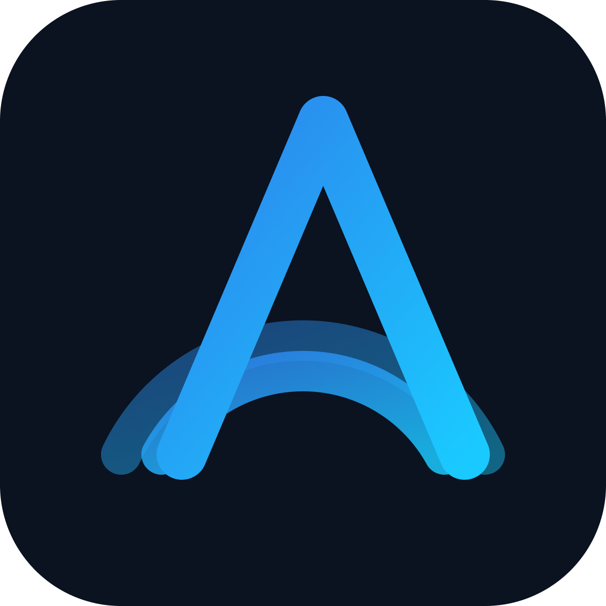

# Acton

Blazingly fast ~~shit~~ toolkit for TON application development written in
Rust.

## Building

Clone TON monorepo fork:

```
git clone https://github.com/i582/ton/tree/pmakhnev/acton
```

Build and copy artifacts to `./objs`:

```
sh assembly/native/build-macos-static.sh -a && mkdir ../acton/objs && cp ./artifacts/libemulator.a ./artifacts/libtolk.a ../acton/objs
```

Run Rust compilation:

```
cargo build
```

In release mode:

```
cargo build --release
```

## Run

```
target/debug/acton test foo.test.tolk
# or target/release/acton test foo.test.tolk
```

## Documentation

See [Documentation](https://i582.github.io/acton/docs/welcome/).

## Development

### Prerequisites

To run tests and contribute to Acton, you'll need to install the following
dependencies:

1. **just**: Command runner used for all development tasks.
   ```bash
   cargo install just
   ```
2. **cargo-nextest**: Modern test runner (highly recommended for faster and
   better test output).
   ```bash
   cargo install cargo-nextest
   ```
3. **bun**: Required for building the Acton Test UI.
   ```bash
   curl -fsSL https://bun.sh/install | bash
   ```
4. **cargo-llvm-cov**: For test coverage reports (optional).
   ```bash
   cargo install cargo-llvm-cov
   rustup component add llvm-tools-preview
   ```
5. **System Dependencies**:
    - **macOS**: `brew install libsodium libmicrohttpd pkg-config graphviz`
    - **Linux**:
      `sudo apt install libsodium-dev libmicrohttpd-dev pkg-config graphviz`

### Running Tests

Run all tests (automatically uses `nextest` if available):

```bash
just test
```

Update test snapshots:

```bash
just test-update
```

Run specific test suites:

```bash
# Integration tests
cargo test --test integration_test

# Debugger tests (must run sequentially)
cargo test --test debug_test -- --test-threads 1
```

To save test artifacts:

```
DISABLE_TMP_DIR_CLEANUP_IN_TESTS=1 just test
```

See also: [justfile](justfile) for all available commands.
