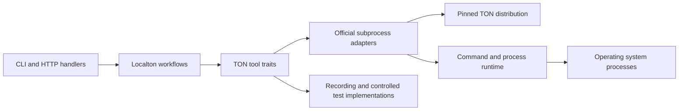
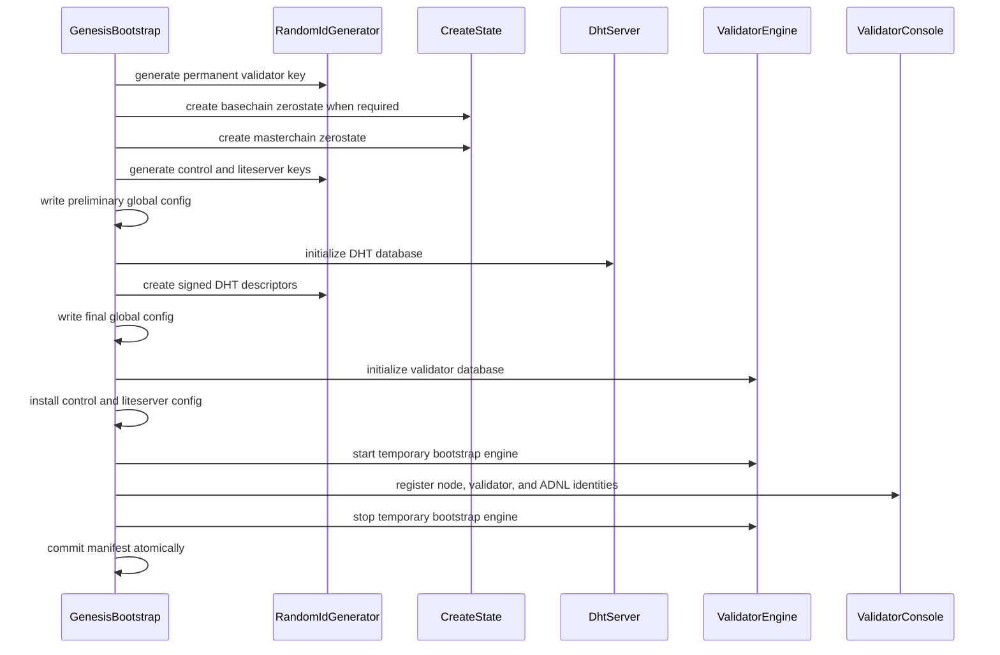

# Localton TON Toolchain Architecture

Localton creates, joins, and operates a real TON network while delegating protocol-critical work to the official TON toolchain. This document defines the target boundary between Localton workflows and those external programs.

The central decision is to represent every official TON program with a semantic Rust trait. One production implementation invokes the pinned official executable, while compatible native implementations are allowed where Localton already has them. Workflows depend on the trait, never on `tokio::process::Command`, argv strings, or tool-specific stdout.

This architecture keeps Localton orchestration readable, isolates release-specific CLI behavior, and makes complete workflows testable without starting a real network.

## Scope

This design covers the official programs currently required by Localton:

- `create-state`
- `dht-server`
- `fift`
- `generate-random-id`
- `lite-client`
- `validator-engine`
- `validator-engine-console`

It also covers:

- resolution and validation of the pinned TON distribution
- one-shot command execution
- long-running process supervision
- typed inputs and outputs
- genesis and node bootstrap workflows
- validator identity configuration
- local chain operations
- diagnostics, observability, and tests

It does not replace TON protocols or reimplement consensus. `validator-engine`, ADNL, DHT, overlays, liteserver, Elector, and validator elections remain ordinary TON components.

## Goals

- Bootstrap code describes network operations instead of command-line syntax
- Every official program has one explicit Rust contract
- Version-specific flags and output parsing stay in one implementation
- The real subprocess implementation is replaceable in tests
- Native implementations can replace a binary when they provide the same semantics
- One-shot commands and long-running services have different lifecycle contracts
- Process errors preserve useful diagnostics without leaking private key material
- Existing `TonBinaries`, `Toolchain`, `run_checked`, `ManagedProcess`, and `ProcessRegistry` evolve instead of being duplicated
- A TON release upgrade has a small, reviewable compatibility surface

## Non-goals

- A generic shell-command framework for arbitrary programs
- A fluent builder that only renames `.arg()` calls
- A Rust rewrite of the official TON node
- Hiding meaningful TON concepts such as ADNL identities, zerostates, validator keys, or liteserver endpoints
- Supporting multiple historical Localton APIs in parallel
- Mocking TON consensus in production code

## Current problem

The current code has the correct high-level workflow, but several modules own too many concerns at once.

For example, DHT bootstrap currently:

- decides when DHT initialization happens
- constructs `dht-server` argv
- executes the child process
- patches generated files
- constructs `generate-random-id` argv
- parses noisy JSON output
- returns descriptors to genesis bootstrap

Validator bootstrap similarly constructs `validator-engine` and `validator-engine-console` commands, interprets console output, applies command-specific exit-code exceptions, retries mutations, restarts the temporary engine, and decides the identity-registration order.

The existing `ton::toolchain::Toolchain` repeats part of this boundary for Fift, lite-client, and validator console operations. Adding another abstraction beside it would duplicate logic. The target architecture therefore evolves the existing types:

| Current type | Target responsibility |
| --- | --- |
| `TonBinaries` | Resolve and validate one pinned TON distribution |
| `Toolchain` | Become the dependency bundle of typed TON interfaces |
| `run_checked` | Power the real one-shot subprocess runtime |
| `ManagedProcess` | Implement the real long-running service handle |
| `ProcessRegistry` | Supervise implementation-independent service handles |
| `bootstrap::*` | Orchestrate typed operations and Localton-owned files |
| `operations::*` | Use typed node, console, Fift, and chain interfaces |

## Architectural boundaries

The target code has four layers.



### Localton workflows

Workflows own intent and ordering:

- create a new network identity
- break the preliminary-global-config and DHT-descriptor cycle
- initialize a node database
- configure a temporary engine through its control console
- restart an engine when a workflow transition requires it
- start persistent services
- wait for chain readiness
- join elections and recover stake

Workflows may read and write Localton-owned state. They must not construct raw argv or parse tool stdout.

### TON tool traits

Each trait represents the semantic operations Localton needs from one official program. Requests and results use TON concepts and typed filesystem artifacts.

The public contract must not expose:

- `tokio::process::Command`
- executable paths
- positional argv
- raw exit statuses
- unparsed stdout as the only result

Raw output can be retained as diagnostic context, but it is not the workflow API.

### Official adapters

An official adapter translates one trait operation into the CLI contract of the pinned TON release. It owns:

- flags and positional arguments
- working directories and environment variables
- stdout and stderr parsing
- command-specific successful exit conditions
- validation of artifacts promised by the operation
- redaction of sensitive invocation data

An adapter does not decide the multi-tool workflow or mutate unrelated Localton state.

### Process runtime

The runtime owns operating-system mechanics:

- stdin, stdout, and stderr wiring
- timeout and cancellation
- `kill_on_drop` for one-shot calls
- process-group creation and termination
- PID reporting
- early-exit detection
- coordinated shutdown

It knows nothing about DHT, validators, elections, or zerostates.

## Proposed module layout

```text
apps/localton/src/
├── binaries/
│   ├── mod.rs                 # TonDistribution resolution and validation
│   ├── install.rs             # Shared release cache and download progress
│   └── release.rs             # Pinned release manifest and checksums
├── ton/
│   ├── mod.rs
│   ├── toolchain.rs           # TonToolchain dependency bundle
│   ├── types.rs               # Shared TON value types and artifact paths
│   └── tools/
│       ├── mod.rs
│       ├── create_state.rs    # CreateState trait and OfficialCreateState
│       ├── dht_server.rs      # DhtServer trait and OfficialDhtServer
│       ├── fift.rs            # Fift trait and OfficialFift
│       ├── random_id.rs       # RandomIdGenerator trait and official adapter
│       ├── lite_client.rs     # LiteClient trait and available adapters
│       ├── validator_engine.rs
│       └── validator_console.rs
├── bootstrap/
│   ├── genesis.rs             # Genesis workflow
│   ├── dht.rs                 # DHT/global-config workflow
│   ├── validator.rs           # Validator identity workflow
│   ├── nodes.rs               # Genesis startup and follower initialization
│   └── pipeline.rs            # Launcher lifecycle
└── runtime/
    ├── command.rs             # One-shot subprocess execution
    ├── process.rs             # ManagedProcess
    ├── service.rs             # ManagedService and ServiceHandle
    └── registry.rs            # Implementation-independent supervision
```

Trait contracts and their production implementation initially live in the same per-program module. This keeps the interface beside the code that translates it to the pinned release. Separate `official/` and `testing/` trees should be introduced only if those files become difficult to navigate.

## Distribution boundary

`TonBinaries` should be renamed to `TonDistribution` when this architecture is implemented. It remains responsible for installation and immutable release resources, not execution.

```rust
#[derive(Debug, Clone)]
pub struct TonDistribution {
    root: PathBuf,
    release: TonRelease,
}

impl TonDistribution {
    pub async fn resolve(request: ResolveDistribution) -> Result<Self>;
    pub fn release(&self) -> &TonRelease;
    pub fn resources(&self) -> TonResources;
}
```

Executable lookup becomes private to `ton::tools` production adapters. Workflow code must not regain a stringly `command("validator-engine")` escape hatch.

`TonResources` exposes only resource directories that are legitimate workflow inputs:

```rust
#[derive(Debug, Clone)]
pub struct TonResources {
    pub lib_dir: PathBuf,
    pub smartcont_dir: PathBuf,
}
```

The distribution validates all required programs and resources once before `TonToolchain` is built.

## Toolchain dependency bundle

The existing `ton::toolchain::Toolchain` becomes the single dependency bundle used by workflows and operations.

```rust
#[derive(Clone)]
pub struct TonToolchain {
    pub create_state: Arc<dyn CreateState>,
    pub dht_server: Arc<dyn DhtServer>,
    pub fift: Arc<dyn Fift>,
    pub random_id: Arc<dyn RandomIdGenerator>,
    pub lite_client: Arc<dyn LiteClient>,
    pub validator_engine: Arc<dyn ValidatorEngine>,
    pub validator_console: Arc<dyn ValidatorConsole>,
    pub resources: TonResources,
}
```

`TonToolchain::official` constructs every production adapter from the same validated distribution and process runtime.

```rust
impl TonToolchain {
    pub fn official(
        distribution: TonDistribution,
        runtime: ProcessRuntime,
    ) -> Result<Self>;
}
```

CLI commands that also need a `Layout` receive it separately. Layout is Localton state, not a property of the TON distribution.

Traits use object-safe async methods so one dependency bundle can be cloned into launcher services. The implementation can use `async-trait`; adding that workspace dependency is preferable to spreading boxed-future signatures through every interface.

## Shared value types

Strings are acceptable for human-readable names. Protocol identifiers and security-sensitive paths should use explicit types.

```rust
pub struct KeyId([u8; 32]);
pub struct PublicKey([u8; 32]);
pub struct PrivateKeyPath(PathBuf);
pub struct PublicKeyPath(PathBuf);

pub struct AdnlEndpoint {
    pub ip: Ipv4Addr,
    pub port: u16,
}

pub struct ConsoleEndpoint {
    pub address: SocketAddr,
    pub client_private_key: PrivateKeyPath,
    pub server_public_key: PublicKeyPath,
}

pub struct ZeroStateArtifacts {
    pub boc: PathBuf,
    pub root_hash: [u8; 32],
    pub file_hash: [u8; 32],
}

pub struct GeneratedKey {
    pub id: KeyId,
    pub public_key: PublicKey,
    pub private_path: PrivateKeyPath,
    pub public_path: PublicKeyPath,
}
```

Parsing, hexadecimal formatting, and base64 formatting live on these types. Workflows should not repeatedly validate a 64-character string or manually strip a four-byte TL prefix.

Newtypes should be introduced where they prevent a real mix-up. Paths with identical semantics do not need unique wrappers merely to increase the type count.

## Execution context

Every one-shot operation receives a consistent execution policy without embedding launcher settings into tool contracts.

```rust
#[derive(Debug, Clone)]
pub struct OperationContext {
    pub timeout: Duration,
    pub node_name: Option<String>,
}
```

Timeout and retry have different owners:

- the workflow chooses how long an operation may take
- the official adapter enforces the deadline through the process runtime
- the workflow retries semantic operations when doing so is safe
- the adapter may normalize a release-specific successful disconnect or output shape

The validator-console adapter must not silently retry every mutation. Some console operations are not safe to repeat without workflow knowledge.

## Long-running service contract

`dht-server` and `validator-engine` can outlive a single operation. Their `start` methods return an implementation-independent handle.

```rust
#[async_trait]
pub trait ManagedService: Send {
    fn name(&self) -> &str;
    fn pid(&self) -> Option<u32>;
    fn try_status(&mut self) -> Result<Option<ServiceExit>>;
    async fn stop(&mut self) -> Result<()>;
}

pub struct ServiceHandle(Box<dyn ManagedService>);
```

`ManagedProcess` implements `ManagedService`. `ProcessRegistry` stores `ServiceHandle` instead of `ManagedProcess`. Tests can return a controlled service that stays alive, exits on demand, or records shutdown without spawning an operating-system process.

The registry remains responsible for uniqueness, supervision, and shutdown order. Tool adapters do not own the global registry.

## `create-state` interface

`create-state` executes a generated Fift state-creation script and produces a zerostate artifact set.

```rust
#[derive(Debug, Clone, Copy)]
pub enum ZeroStateKind {
    Masterchain,
    Basechain,
}

pub struct CreateStateRequest {
    pub kind: ZeroStateKind,
    pub script: PathBuf,
    pub output_dir: PathBuf,
    pub include_paths: Vec<PathBuf>,
}

#[async_trait]
pub trait CreateState: Send + Sync {
    async fn create(
        &self,
        context: &OperationContext,
        request: CreateStateRequest,
    ) -> Result<ZeroStateArtifacts>;
}
```

`OfficialCreateState` owns `FIFTPATH`, the working directory, stderr normalization, and verification of `.boc`, `.rhash`, and `.fhash` outputs.

Genesis workflow still owns script generation and the decision to create basechain before masterchain when imported accounts are present.

## `generate-random-id` interface

This program has two separate semantic operations in Localton and should expose both explicitly.

```rust
pub struct GenerateKeyRequest {
    pub private_path: PrivateKeyPath,
}

pub struct DhtDescriptorRequest {
    pub private_key: PrivateKeyPath,
    pub address: AdnlEndpoint,
    pub address_list_path: PathBuf,
}

#[async_trait]
pub trait RandomIdGenerator: Send + Sync {
    async fn generate_key(
        &self,
        context: &OperationContext,
        request: GenerateKeyRequest,
    ) -> Result<GeneratedKey>;

    async fn create_dht_descriptor(
        &self,
        context: &OperationContext,
        request: DhtDescriptorRequest,
    ) -> Result<DhtNodeDescriptor>;
}
```

`OfficialRandomIdGenerator` owns `-m keys`, `-m dht`, numeric IPv4 serialization, noisy JSON extraction, and key output parsing.

The DHT trait does not create descriptors because descriptors are produced by a different official program. Keeping this boundary one-to-one is deliberate.

## `dht-server` interface

Initialization and persistent operation use different request types because they have different postconditions.

```rust
pub struct DhtInitializeRequest {
    pub global_config: PathBuf,
    pub database: PathBuf,
    pub log_path: PathBuf,
    pub endpoint: AdnlEndpoint,
    pub out_port: u16,
    pub threads: usize,
    pub verbosity: u8,
}

pub struct DhtDatabase {
    pub path: PathBuf,
    pub config: PathBuf,
    pub keyring: Vec<PrivateKeyPath>,
}

pub struct DhtStartRequest {
    pub global_config: PathBuf,
    pub database: DhtDatabase,
    pub log_path: PathBuf,
    pub endpoint: AdnlEndpoint,
    pub threads: usize,
    pub verbosity: u8,
}

#[async_trait]
pub trait DhtServer: Send + Sync {
    async fn initialize(
        &self,
        context: &OperationContext,
        request: DhtInitializeRequest,
    ) -> Result<DhtDatabase>;

    async fn start(&self, request: DhtStartRequest) -> Result<ServiceHandle>;
}
```

`OfficialDhtServer` validates the binary-owned database and config. Patching Localton's selected `out_port` remains an explicit adapter post-processing step because it completes the semantic initialization request.

The DHT/global-config cycle remains visible in `bootstrap::dht`:

```rust
let preliminary = global_config.with_dht_nodes([]);
preliminary.save()?;

let database = tools.dht_server.initialize(context, init).await?;
let descriptors = descriptors_for(database.keyring, tools.random_id.as_ref()).await?;

global_config.with_dht_nodes(descriptors).save()?;
```

## `validator-engine` interface

Engine database creation, temporary bootstrap operation, and persistent node operation are separate semantics.

```rust
pub struct ValidatorInitializeRequest {
    pub global_config: PathBuf,
    pub database: PathBuf,
    pub log_path: PathBuf,
    pub endpoint: AdnlEndpoint,
    pub out_port: u16,
    pub threads: usize,
    pub verbosity: u8,
}

pub struct ValidatorDatabase {
    pub path: PathBuf,
    pub config: PathBuf,
}

pub struct ValidatorBootstrapRequest {
    pub database: ValidatorDatabase,
    pub log_path: PathBuf,
    pub endpoint: AdnlEndpoint,
}

pub struct ValidatorStartRequest {
    pub database: ValidatorDatabase,
    pub log_path: PathBuf,
    pub endpoint: AdnlEndpoint,
    pub retention: RetentionPolicy,
    pub initial_sync_delay: Duration,
}

#[async_trait]
pub trait ValidatorEngine: Send + Sync {
    async fn initialize(
        &self,
        context: &OperationContext,
        request: ValidatorInitializeRequest,
    ) -> Result<ValidatorDatabase>;

    async fn start_bootstrap(
        &self,
        request: ValidatorBootstrapRequest,
    ) -> Result<ServiceHandle>;

    async fn start_persistent(
        &self,
        request: ValidatorStartRequest,
    ) -> Result<ServiceHandle>;
}
```

Distinct start methods prevent a boolean such as `persistent: bool` from changing a large set of flags invisibly.

`OfficialValidatorEngine` owns the exact release flags. It does not register keys or decide how many times a temporary engine should restart.

## `validator-engine-console` interface

The console trait exposes operations, not an unbounded `execute(&str)` method.

```rust
#[async_trait]
pub trait ValidatorConsole: Send + Sync {
    async fn health(
        &self,
        context: &OperationContext,
        endpoint: &ConsoleEndpoint,
    ) -> Result<ValidatorStats>;

    async fn new_key(
        &self,
        context: &OperationContext,
        endpoint: &ConsoleEndpoint,
    ) -> Result<KeyId>;

    async fn export_public(
        &self,
        context: &OperationContext,
        endpoint: &ConsoleEndpoint,
        key: &KeyId,
    ) -> Result<PublicKeyPath>;

    async fn add_permanent_key(
        &self,
        context: &OperationContext,
        endpoint: &ConsoleEndpoint,
        request: AddPermanentKey,
    ) -> Result<()>;

    async fn add_temporary_key(
        &self,
        context: &OperationContext,
        endpoint: &ConsoleEndpoint,
        request: AddTemporaryKey,
    ) -> Result<()>;

    async fn add_adnl(
        &self,
        context: &OperationContext,
        endpoint: &ConsoleEndpoint,
        request: AddAdnl,
    ) -> Result<()>;

    async fn add_validator_address(
        &self,
        context: &OperationContext,
        endpoint: &ConsoleEndpoint,
        request: AddValidatorAddress,
    ) -> Result<()>;

    async fn change_full_node_address(
        &self,
        context: &OperationContext,
        endpoint: &ConsoleEndpoint,
        request: ChangeFullNodeAddress,
    ) -> Result<()>;

    async fn import_private_key(
        &self,
        context: &OperationContext,
        endpoint: &ConsoleEndpoint,
        request: ImportPrivateKey,
    ) -> Result<()>;

    async fn sign(
        &self,
        context: &OperationContext,
        endpoint: &ConsoleEndpoint,
        request: SignRequest,
    ) -> Result<Signature>;
}
```

Private adapter code may use a typed `ValidatorConsoleCommand` enum to render `-rc` text. The enum is not the workflow API.

Release-specific behavior belongs in `OfficialValidatorConsole`. For example, a connection drop after `changefullnodeaddr` can be normalized as success when the pinned release documents that transition through its observed output. Restarting the temporary engine after that transition remains a workflow decision.

## `fift` interface

Fift is an interpreter, so executing a script is itself the correct semantic boundary. The trait should still make paths, arguments, and results explicit.

```rust
pub struct FiftScriptRequest {
    pub script: PathBuf,
    pub arguments: Vec<OsString>,
    pub current_dir: PathBuf,
    pub include_paths: Vec<PathBuf>,
}

pub struct FiftOutput {
    pub stdout: String,
    pub stderr: String,
}

#[async_trait]
pub trait Fift: Send + Sync {
    async fn run_script(
        &self,
        context: &OperationContext,
        request: FiftScriptRequest,
    ) -> Result<FiftOutput>;
}
```

Wallet and election modules remain responsible for choosing the correct official script and interpreting its domain artifact. `OfficialFift` owns `FIFTPATH`, process execution, and base output handling.

## `lite-client` and native ADNL

Localton already has a native `LocalLiteClient`. The architecture must not force chain operations through an external process merely because `lite-client` exists in the distribution.

The trait therefore represents supported chain queries, not arbitrary lite-client command strings.

```rust
#[async_trait]
pub trait LiteClient: Send + Sync {
    async fn masterchain_info(&self, target: &LiteTarget) -> Result<MasterchainInfo>;
    async fn lookup_block(
        &self,
        target: &LiteTarget,
        request: LookupBlock,
    ) -> Result<BlockIdExt>;
    async fn get_block(&self, target: &LiteTarget, id: &BlockIdExt) -> Result<BlockData>;
    async fn account_state(
        &self,
        target: &LiteTarget,
        address: &Address,
    ) -> Result<AccountState>;
    async fn send_message(
        &self,
        target: &LiteTarget,
        message: &Boc,
    ) -> Result<SendMessageResult>;
    async fn run_method(
        &self,
        target: &LiteTarget,
        request: RunMethod,
    ) -> Result<RunMethodResult>;
}
```

`LiteTarget` identifies the network configuration and selected liteserver. This keeps the toolchain reusable while each launcher or agent chooses its own local endpoint.

Two implementations are useful:

- `NativeLiteClient`, backed by the existing Rust ADNL client, is the default for Localton workflows
- `OfficialLiteClient`, backed by the official executable, is a compatibility and diagnostic implementation

If the executable supports an operation that has no typed contract yet, add the operation to the trait. Do not add a permanent `raw_command` escape hatch to application workflows.

## Genesis bootstrap workflow

After migration, genesis initialization reads as a sequence of network operations.



The manifest remains the commit marker. A failed workflow may leave intermediate artifacts, but it must not publish a completed network identity.

The validator identity sub-workflow owns:

- waiting for authenticated console readiness
- creating engine-owned keys
- registering permanent, temporary, validator ADNL, and full-node ADNL roles
- bounded engine restarts required by identity transitions
- importing the externally generated genesis validator key
- stopping the temporary service on every exit path

The console adapter owns only individual console operations and their parsing.

## Node startup workflow

The launcher owns only genesis startup:

```text
resolve state and distribution
    -> construct TonToolchain
    -> validate or create persistent network
    -> start DHT service
    -> start genesis validator-engine service
    -> prove increasing masterchain seqnos
    -> start optional HTTP services
    -> publish ready state
    -> supervise services until shutdown or failure
```

Every follower starts through an agent, even when it runs on the launcher host:

```text
fetch or reuse the global config
    -> allocate and persist one contiguous host port range
    -> initialize independent node databases and identities
    -> start signed observability with synchronizing status
    -> synchronize each node over ADNL
    -> enable local chain operations and validator automation
    -> supervise services until shutdown or failure
```

An agent uses the same `ValidatorEngine` and `ValidatorConsole` contracts as the genesis launcher. Joining a network changes workflow inputs, not the subprocess abstraction.

Signal handling covers the complete agent workflow, including initialization and
ADNL catch-up. `Ctrl+C`, a child failure, and a normal steady-state shutdown all
converge on `ProcessRegistry::stop_all` and the same atomic runtime-state cleanup.
This boundary must be installed before the first TON subprocess starts: handling
signals only after synchronization can orphan validator-engine when startup is
interrupted. Dropping partially started HTTP services also cancels their tasks.

## Configuration ownership

Configuration files fall into two categories.

### Binary-owned files

Examples include generated `validator-engine` and DHT database config. The official adapter may validate and narrowly patch fields required by its semantic request.

The adapter must preserve unknown fields so a TON release can extend its schema without Localton deleting data.

### Localton-owned files

Examples include settings, runtime state, manifest, preliminary and final global config, generated bootstrap scripts, and observability state. Workflows or storage modules own these files.

Tool adapters receive their paths as inputs but must not discover unrelated paths through a global `Layout`.

## Error model

Tool failures need a stable structured core and readable context.

```rust
pub struct ToolFailure {
    pub tool: TonTool,
    pub operation: &'static str,
    pub kind: ToolFailureKind,
    pub diagnostics: ToolDiagnostics,
}

pub enum ToolFailureKind {
    Spawn,
    Timeout { duration: Duration },
    Exit { code: Option<i32> },
    InvalidOutput,
    MissingArtifact,
    Protocol,
}

pub struct ToolDiagnostics {
    pub stdout: RedactedText,
    pub stderr: RedactedText,
}
```

Adapters convert raw failures into semantic errors. Workflows add network, node, and stage context with `anyhow::Context` at their boundary.

Error messages should answer:

- which TON program failed
- which semantic operation failed
- which node and workflow stage were active
- whether the process timed out, exited, or returned invalid data
- which expected artifact was absent
- where complete redacted logs are stored

Command rendering must not print private key bytes, wallet seed material, or signed payload contents. Key identifiers and paths can be logged when they are operationally necessary.

## Observability

Signed node heartbeats and chain inspection run in separate tasks. Heartbeats
publish the latest completed chain snapshot and must never await liteserver,
block-scanning, election, or node-head queries. This keeps a live observer online
while its node synchronizes or a chain query exceeds the observation TTL.

Every production adapter emits one span per semantic operation.

Workflows also emit progress events at stage boundaries so a long genesis, node synchronization, election operation, or tool download never looks hung. A start event identifies the operation and target, intermediate events identify externally meaningful milestones, and the completion event records duration and outcome.

Recommended fields:

- `ton.tool`
- `ton.release`
- `operation`
- `implementation`
- `node`
- `duration_ms`
- `outcome`
- `exit_code` when relevant
- `retry_attempt` when the workflow retries
- `log_path` when complete subprocess output is stored outside the structured event

Long-running service events include:

- spawn and PID
- readiness
- restart reason
- unexpected exit
- graceful stop duration
- forced termination

Metrics and logs describe semantic operations. They should not require operators to understand the exact argv of release `v2026.06` to diagnose a failed DHT initialization.

## Testing strategy

Tests operate at three different boundaries.

### Adapter contract snapshots

Each official adapter has snapshots for:

- rendered executable, argv, environment, and working directory
- representative successful stdout and stderr parsing
- representative non-zero exits
- missing or malformed artifacts
- release-specific exceptional success conditions

Snapshots make a release upgrade show the entire CLI contract change in review.

### Workflow integration snapshots

Recording implementations append semantic calls to an ordered event log.

```text
random_id.generate_key role=validator
create_state.create kind=masterchain
random_id.generate_key role=control_server
dht_server.initialize endpoint=192.168.27.4:6302
random_id.create_dht_descriptor key=...
validator_engine.initialize node=genesis
validator_engine.start_bootstrap node=genesis
validator_console.new_key role=full_node_adnl
validator_console.change_full_node_address key=...
validator_engine.stop_bootstrap node=genesis
manifest.commit
```

Snapshotting the complete event sequence protects ordering and cleanup behavior better than many isolated assertions.

Required workflow scenarios include:

- genesis without imported accounts
- genesis with a separately generated basechain
- DHT initialization with multiple keyring keys
- temporary validator exit before console readiness
- full-node ADNL transition that disconnects the console
- validator-key import requiring a bounded restart
- failure after service start followed by guaranteed cleanup
- agent initialization and subsequent reuse of its database

### Real TON integration tests

A smaller suite runs the pinned official release and proves:

- zerostates are accepted by validator-engine
- DHT descriptors are accepted by peers
- console identity registration survives a persistent restart
- a node reaches a local liteserver
- masterchain seqno advances
- an agent synchronizes through the network rather than copied block state

These tests validate the external contract. Recording tests validate Localton orchestration.

## Release upgrades

The official implementation is a release adapter. Upgrading TON follows this order:

- update the pinned release and checksums
- run adapter contract snapshots against the new executables
- review every argv or output change
- update only affected official adapters
- run real TON integration tests
- verify genesis, node join, synchronization, elections, and shutdown

Workflow traits should change only when Localton needs new semantics. A renamed binary flag is not a reason to change workflow code.

If two supported releases require incompatible behavior, introduce an internal adapter strategy selected by `TonRelease`. Do not expose release checks throughout bootstrap modules.

## Migration plan

Migration stays incremental and keeps behavior stable at each step.

### Establish shared contracts

- Add `ton::tools` and shared value types
- Add `OperationContext`, `ManagedService`, and `ServiceHandle`
- Make `ManagedProcess` implement `ManagedService`
- Change `ProcessRegistry` to own service handles
- Keep the current launcher behavior unchanged

### Move DHT and random identity operations

- Move key generation behind `RandomIdGenerator`
- Move DHT descriptor generation behind the same trait
- Move DHT initialization and persistent start behind `DhtServer`
- Convert `bootstrap::dht` into the DHT/global-config workflow
- Add adapter and workflow snapshots

This is the first implementation slice because it exercises one-shot execution, output parsing, generated artifacts, a long-running service, and composition of two distinct programs.

### Move validator lifecycle

- Move validator database initialization and start modes behind `ValidatorEngine`
- Move every currently used console command behind `ValidatorConsole`
- Keep retries and temporary-engine restarts in the validator identity workflow
- Replace `persistent: bool` with separate request types
- Add failure and restart snapshots

### Move state creation and Fift

- Move `create-state` execution and artifact validation behind `CreateState`
- Move existing `Toolchain::fift` behavior behind `Fift`
- Preserve script selection in wallet, elections, and genesis workflows

### Unify chain access

- Define the typed `LiteClient` operations Localton currently uses
- Make the existing native ADNL client the default implementation
- Add the official executable adapter only for supported compatibility and diagnostic cases
- Remove raw lite-client command construction from workflows

### Collapse the old facade

- Replace the fields and methods of the existing `Toolchain` with `TonToolchain`
- Remove direct `TonBinaries::command` access outside official adapters
- Remove duplicated validator-console construction
- Rename `TonBinaries` to `TonDistribution`
- Enforce the boundary with module visibility and a source-level lint or repository check if direct `Command::new` calls reappear in bootstrap and operations modules

No compatibility layer is required for the internal Rust API. Call sites should migrate directly.

## Design rules

- One trait corresponds to one official program
- Trait methods describe Localton's supported semantics, not raw command syntax
- Separate request types represent materially different modes
- Workflows own ordering, retry safety, and cross-program coordination
- Official adapters own argv, output parsing, and release quirks
- The process runtime owns operating-system lifecycle mechanics
- Distribution resolution owns installation, checksums, and resources
- No workflow calls `TonDistribution::command`
- No workflow receives raw stdout when a typed result is possible
- No general `execute_raw` escape hatch is added for convenience
- No private key bytes appear in logs, snapshots, or error messages
- Fakes record semantic operations rather than emulating shell text
- Integration snapshots cover complete workflows
- Real TON tests remain the final proof of compatibility
- Public types, traits, methods, and non-trivial workflow functions explain why they exist, which layer owns the responsibility, and which lifecycle, safety, idempotency, or TON-specific constraints callers must preserve
- Documentation comments do not merely restate a symbol name or signature

## Expected result

Genesis bootstrap should eventually read like this:

```rust
let validator = tools.random_id.generate_key(context, validator_key).await?;
let zero_states = create_zero_states(context, tools, network, accounts).await?;
let service_keys = create_service_keys(context, tools).await?;
let dht = bootstrap_dht(context, tools, layout, node, &zero_states, &service_keys).await?;
let database = tools.validator_engine.initialize(context, validator_init).await?;
configure_local_services(layout, node, &service_keys)?;
configure_genesis_identity(context, tools, database, node, &validator).await?;
commit_manifest(layout, network_identity)?;
```

The code still performs the same real TON operations. The difference is that a reader sees the network lifecycle first and the release-specific process syntax only when opening an official adapter.

## TON references

This architecture uses the following official TON concepts as its external ground truth:

- [Start here](https://docs.ton.org/llms/start-here/content.md) for the separation between TON nodes, ADNL networking, liteserver access, workchains, and shards
- [Blockchain nodes overview](https://docs.ton.org/llms/nodes/overview/content.md) for full-node, validator, liteserver, and archive-node roles
- [MyTonCtrl core](https://docs.ton.org/llms/nodes/cpp/mytonctrl/core/content.md) for operational mode boundaries, validator lifecycle automation, timeouts, and diagnostics
- [Distributed Hash Table](https://docs.ton.org/llms/foundations/network/dht/content.md) for DHT identities, signed descriptors, ADNL discovery, and shard overlay discovery

The Rust trait layout is a Localton design decision. It is not prescribed by TON Docs.
