The [TON plugin for JetBrains IDEs](https://plugins.jetbrains.com/plugin/23382-ton) supports Acton development, providing project automation and toolchain integration.

For installation instructions, see the [official TON documentation](https://docs.ton.org/contract-dev/ide/jetbrains).

## Supported IDEs

The plugin is compatible with WebStorm, GoLand, PyCharm, CLion, and other JetBrains IDEs.

## Project Management

### Project Wizard
The plugin provides a GUI for `acton new` to set up new projects.

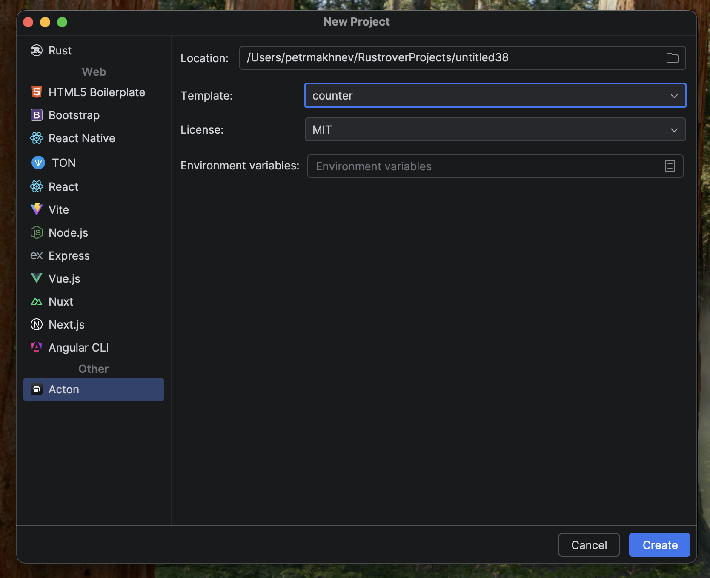

### Run Configurations
After creating or opening a project, the plugin automatically adds run configurations for tests and builds.

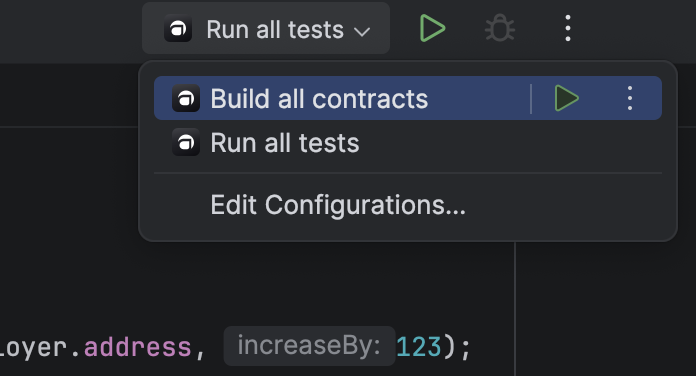

You can also manually create run configurations for any Acton command. Specialized interfaces are available for some commands like `build` or `test`.

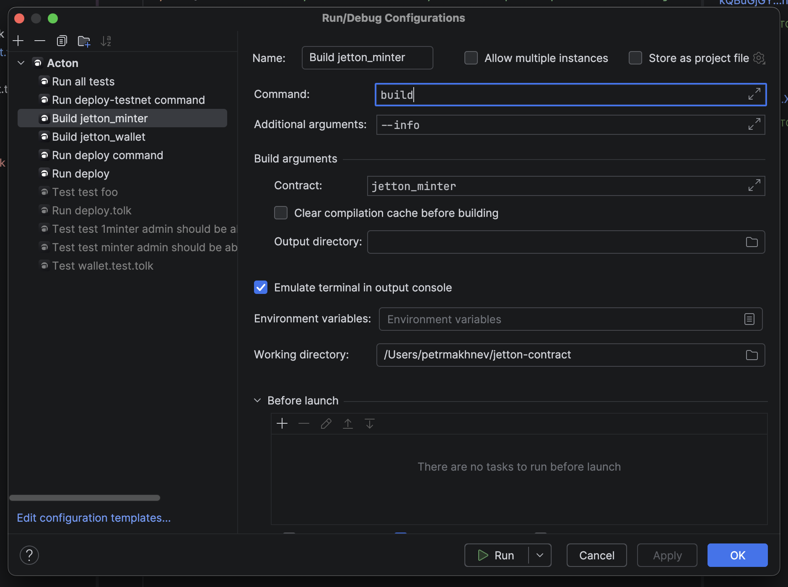

### Updates
The plugin checks for new Acton versions and provides notifications when an update is available.

## Acton.toml Support

### Quick Actions
Gutter icons allow running builds, tests, or scripts directly from the `Acton.toml` file.

#### Building a specific contract

#### Running project tests
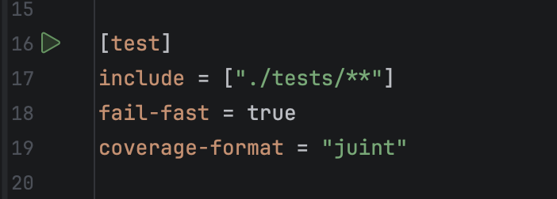

#### Running a script

### Navigation and Autocompletion
The plugin provides autocompletion for contract paths and allows navigating to the source code.

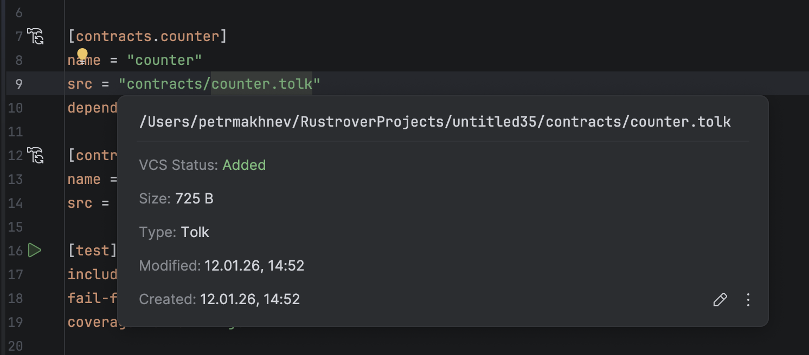

### Fields Documentation
Full validation, autocompletion, and documentation are available for all fields in `Acton.toml`.

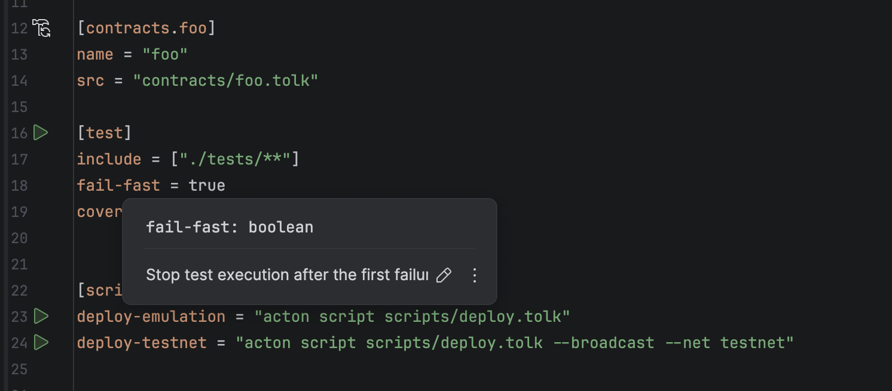

### Contract Usage Search
You can search for all references to a specific contract within the project.

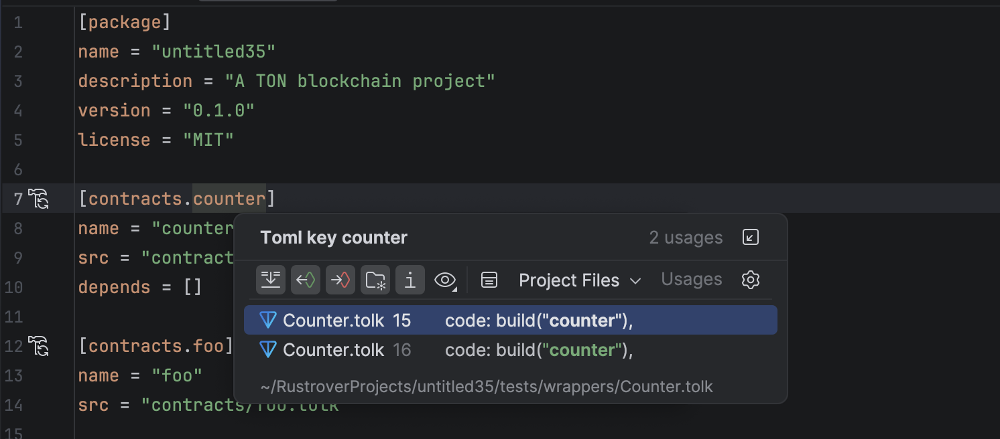

## Contract Management

### Creating a New Contract
The plugin includes a wizard to create new Tolk files and automatically register them in `Acton.toml`.

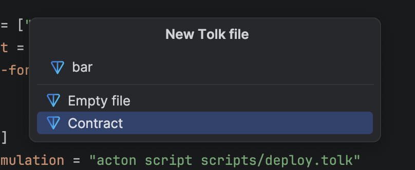

### Contract Registration
If you copy a contract from another project, the plugin will suggest registering it in your configuration.

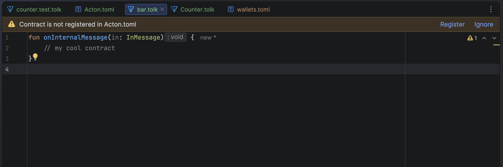

## Code Completion

### Contract Names
Autocompletion and navigation are supported for contract names in the `build()` function.

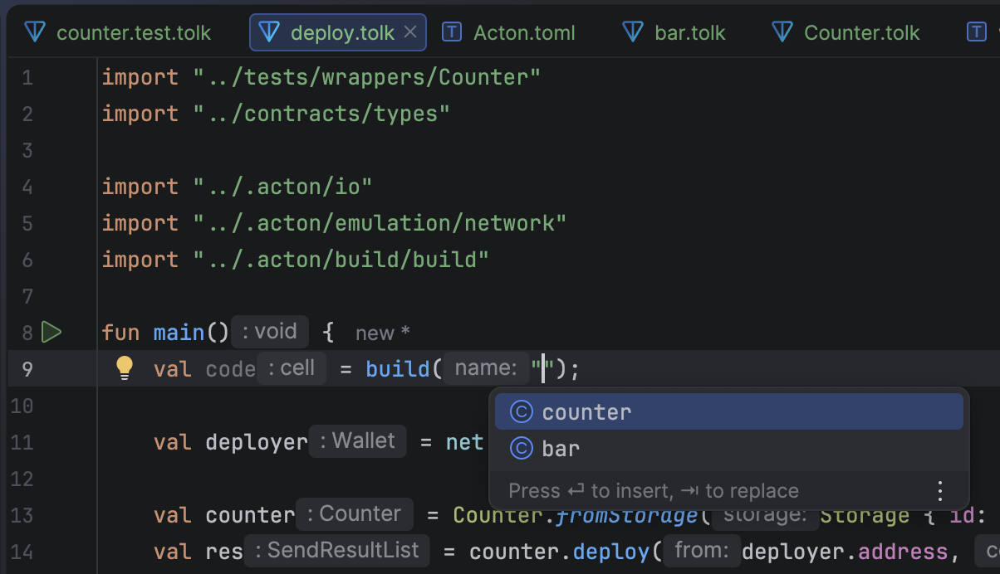

### Wallet Names
The plugin provides autocompletion and navigation for wallet names in the `scripts.wallet()` function.

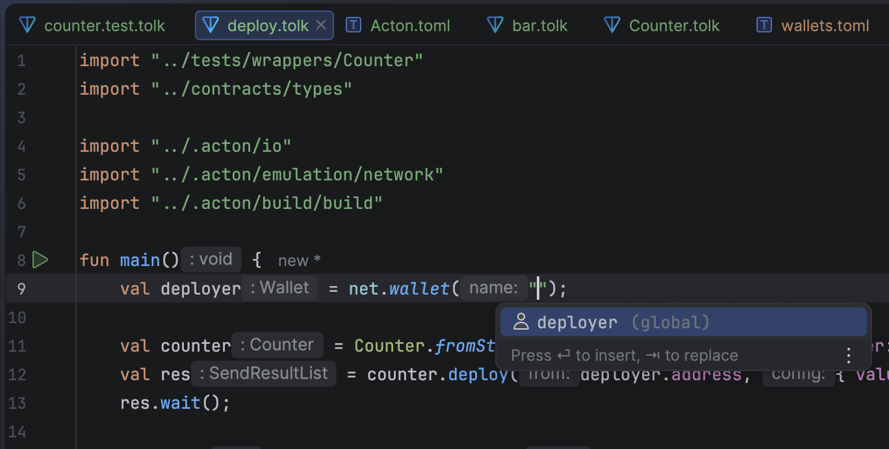

### Get Methods
Autocompletion is available for get method names in `net.runGetMethod()`.

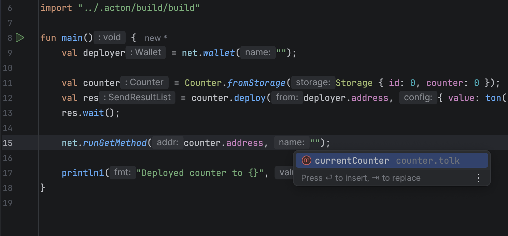

The plugin also finds usages of get methods within `net.runGetMethod()` during a reference search.

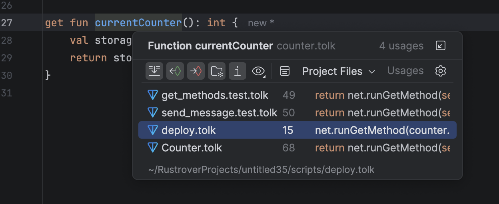

## Testing

### Native Test Runner
Acton tests integrate with the IDE's native test runner, providing a hierarchical view and progress indicators.

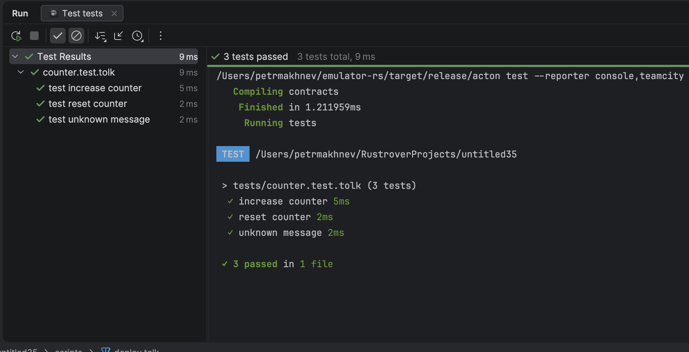

For convenient execution, the plugin provides a test run icon in the editor.

### Failure Analysis
When a test fails, the plugin highlights the specific `expect` call that failed and changes the test icon.

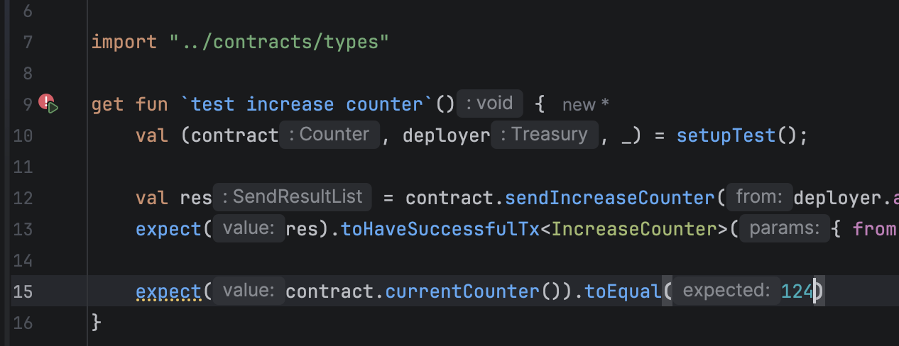

### Code Coverage
Coverage results are displayed in the editor gutter and file tree, showing which contract lines were executed during tests.

### Test Snippets
The `test` live template allows generating test structures by typing `test` and pressing Tab.

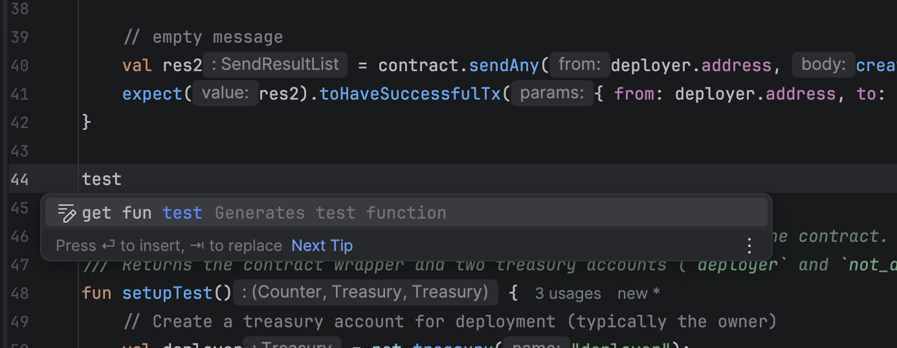

## Toolchain Integration

### Wallet Management
The Wallets View allows managing project wallets, including generation, import via mnemonic, balance tracking, and testnet TON requests.

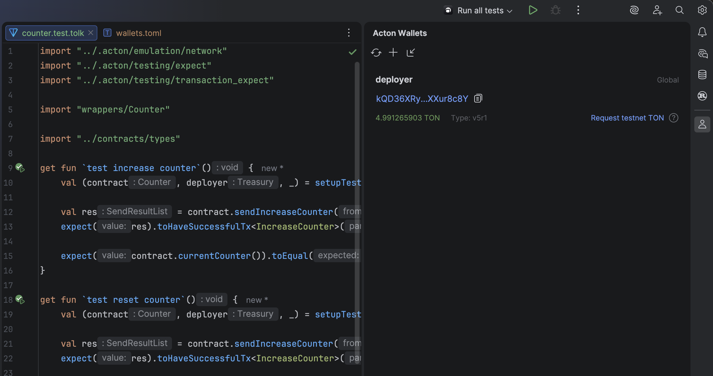

### Terminal Links
TON addresses in the terminal are converted into links that open Tonviewer.

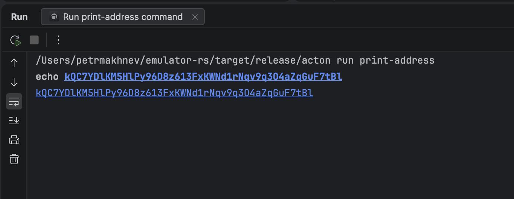

### Script Execution
Scripts can be executed via gutter icons or by creating persistent run configurations.

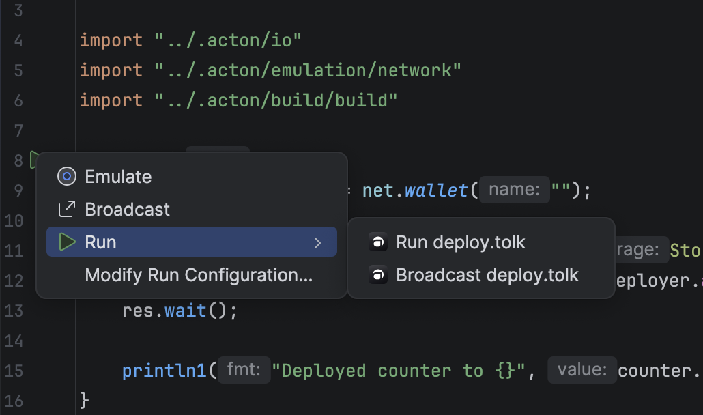

### Linting
The linter runs in the background, reporting any problems it finds and offering automatic fixes if any.

