import {LandingVideo} from "@/components/LandingVideo"

The [TON plugin for JetBrains IDEs](https://plugins.jetbrains.com/plugin/23382-ton) supports Acton development, providing project automation and toolchain integration.

For installation instructions, see the [official TON documentation](https://docs.ton.org/contract-dev/ide/jetbrains).

<Callout type="warning" title="Install the TOML plugin">
  Install the [JetBrains TOML plugin](https://plugins.jetbrains.com/plugin/8195-toml) as well.
  Acton project configuration relies on TOML support, and the TON plugin works correctly only when
  TOML files are handled by the IDE.
</Callout>

The plugin targets JetBrains 2025.2+ IDEs and is compatible with WebStorm, GoLand, PyCharm, CLion, and other JetBrains IDEs.

## Project management

### Project wizard

The plugin provides a GUI for `acton new` to set up new projects.

<LandingVideo
  className="docs-video rounded-lg border bg-fd-muted"
  controls
  controlsList="nodownload noplaybackrate"
  height={1080}
  playsInline
  playLabel="Play new project wizard video"
  preload="metadata"
  src="https://strapi-images-data.s3.eu-central-1.amazonaws.com/tolk/jb-new-project.mp4"
  style={{aspectRatio: "1348 / 1080"}}
  width={1348}
>
  Your browser does not support the video tag.
</LandingVideo>

### Run configurations

After creating or opening a project, the plugin automatically adds run configurations for tests and builds.

<LandingVideo
  className="docs-video rounded-lg border bg-fd-muted"
  controls
  controlsList="nodownload noplaybackrate"
  height={1080}
  playsInline
  playLabel="Play new project wizard video"
  preload="metadata"
  src="https://strapi-images-data.s3.eu-central-1.amazonaws.com/tolk/jb-configurations.mp4"
  style={{aspectRatio: "1648 / 1080"}}
  width={1648}
>
  Your browser does not support the video tag.
</LandingVideo>

Run configurations can also be created manually for any Acton command. Specialized interfaces exist for some commands such as `build` or `test`.

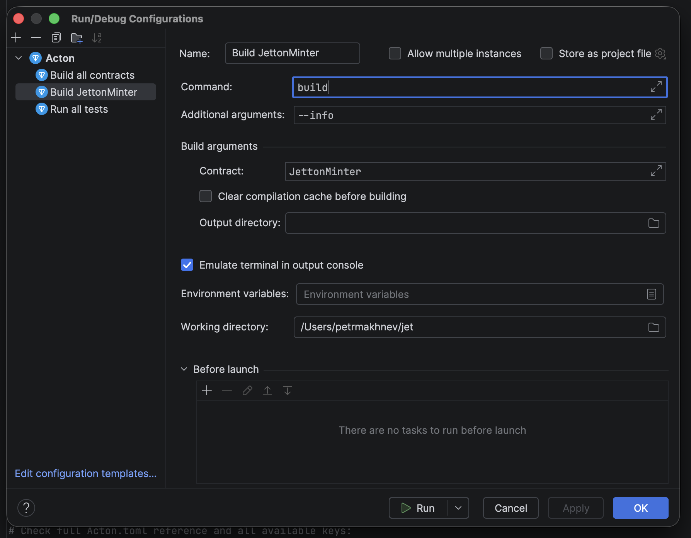

### Updates

The plugin checks for new Acton versions and provides notifications when an update is available.

## `Acton.toml` support

### Quick actions

Gutter icons allow running builds, tests, or scripts directly from the `Acton.toml` file.

#### Building a specific contract

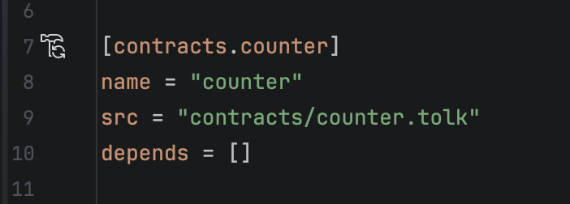

#### Running project tests

#### Running a script

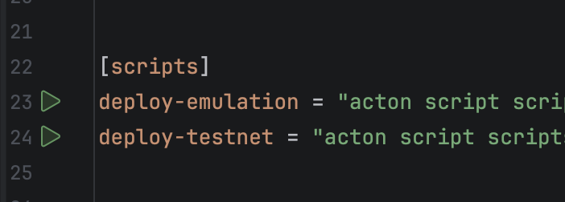

### Navigation and autocompletion

The plugin provides autocompletion for contract paths and allows navigating to the source code.

### Fields documentation

Full validation, autocompletion, and documentation are available for all fields in `Acton.toml`.

### Contract usage search

Search finds all references to a contract in the project.

## Contract management

### Creating a new contract

The plugin includes a wizard to create new Tolk files and automatically register them in `Acton.toml`.

### Contract registration

When copying a contract from another project, the plugin suggests registering it in `Acton.toml`.

### Contract actions

For contracts declared in Tolk files, the plugin provides actions to build the contract and generate
Tolk or TypeScript wrappers.

### Disassembly

The plugin can compile a Tolk contract and open the generated assembly, making it easier to inspect
the code that will run on TVM.

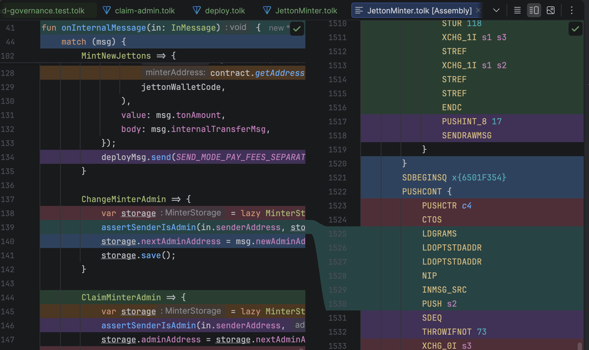

## Code completion

### Contract names

Autocompletion and navigation are supported for contract names in the `build()` function.

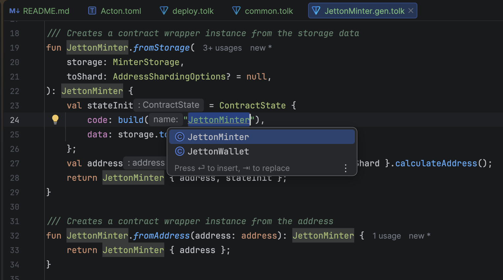

### Wallet names

The plugin provides autocompletion and navigation for wallet names in the `scripts.wallet()` function.

### Get methods

Autocompletion is available for get method names in `net.runGetMethod()`.

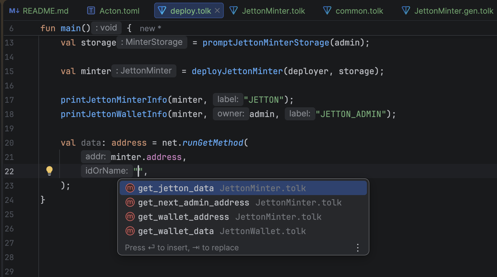

The plugin also finds usages of get methods within `net.runGetMethod()` during a reference search.

## Testing

### Native test runner

Acton tests integrate with the IDE's native test runner, providing a hierarchical view and progress indicators.

<LandingVideo
  className="docs-video rounded-lg border bg-fd-muted"
  controls
  controlsList="nodownload noplaybackrate"
  height={1080}
  playsInline
  playLabel="Play native test runner video"
  preload="metadata"
  src="https://strapi-images-data.s3.eu-central-1.amazonaws.com/tolk/jb-test-runner.mp4"
  style={{aspectRatio: "1576 / 1080"}}
  width={1576}
>
  Your browser does not support the video tag.
</LandingVideo>

For convenient execution, the plugin provides a test run icon in the editor.

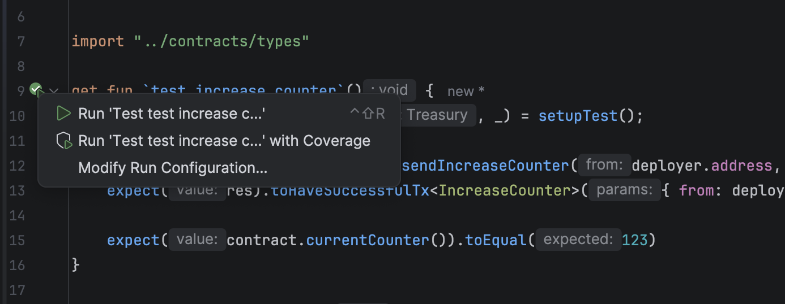

### Failure analysis

When a test fails, the plugin highlights the specific `expect` call that failed and changes the test icon.

### Debugging

Set breakpoints in Tolk tests and contracts, start debugging from the IDE, and inspect stack frames,
local values, and TVM registers.

### Code coverage

Coverage results are displayed in the editor gutter and file tree, showing which contract lines were executed during tests.

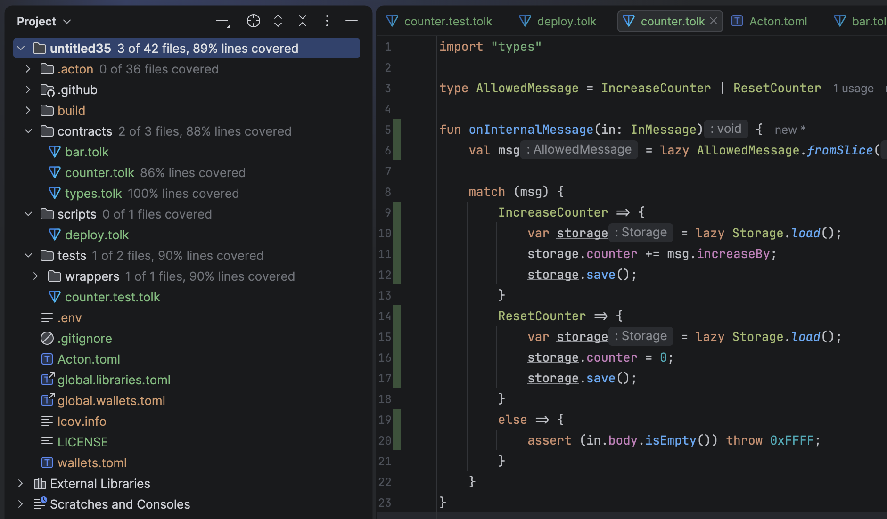

### Test snippets

The `test` live template allows generating test structures by typing `test` and pressing Tab.

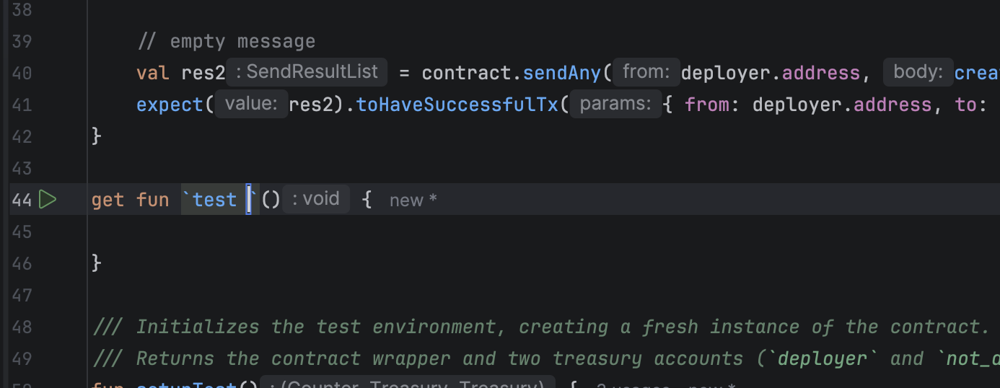

## Toolchain integration

### Wallet management

The Wallets View allows managing project wallets, including generation, import via mnemonic, balance tracking, and testnet GRAM requests.

### Terminal links

TON addresses in the terminal are converted into links that open Tonviewer.

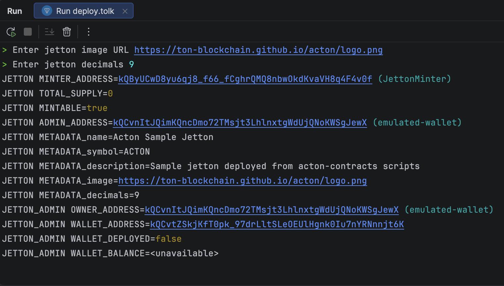

### Script execution

Scripts can be executed via gutter icons or by creating persistent run configurations.

### Linting

The linter runs in the background, reporting any problems it finds and offering automatic fixes if any.

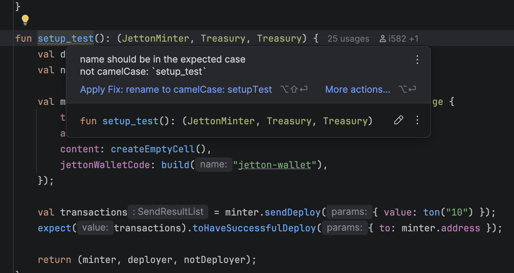
