The [TON extension for VS Code](https://marketplace.visualstudio.com/items?itemName=ton-core.vscode-ton) supports Acton development, providing intelligent features and toolchain integration.

For installation instructions, see the [official TON documentation](https://docs.ton.org/contract-dev/ide/vscode).

## Supported editors

The extension is compatible with:

- Visual Studio Code;
- Cursor;
- Windsurf;
- VSCodium;
- And other VS Code-based editors.

## Recommended TOML extension

We recommend installing [Even Better TOML](https://marketplace.visualstudio.com/items?itemName=tamasfe.even-better-toml)
as well. With it installed, `Acton.toml` gets completion and hover documentation in VS Code-based editors.

## `Acton.toml` support

### Quick actions

Code lenses allow running builds and tests directly from the `Acton.toml` file.

#### Building a specific contract

#### Running project tests

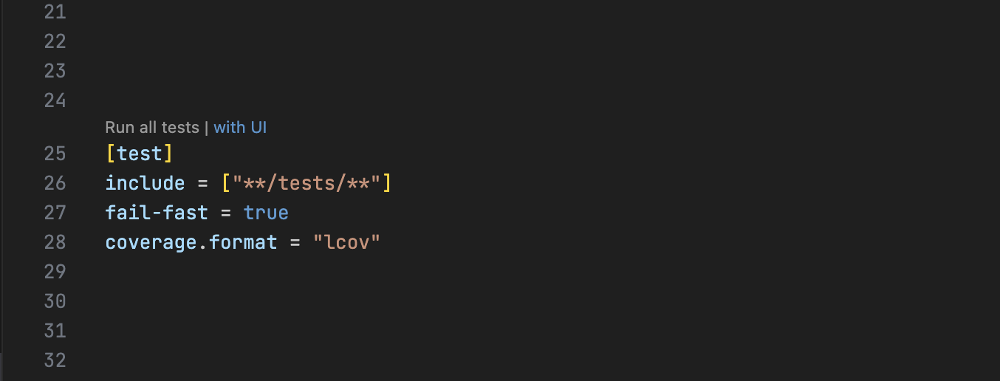

#### Running a script

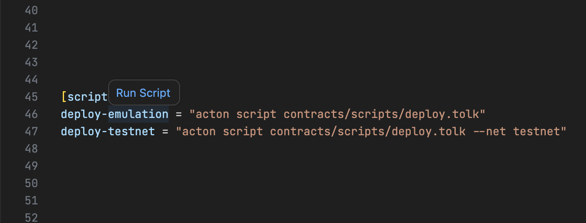

## Contract actions

For contracts declared in Tolk files, the extension adds code lenses to build the contract and
generate Tolk or TypeScript wrappers.

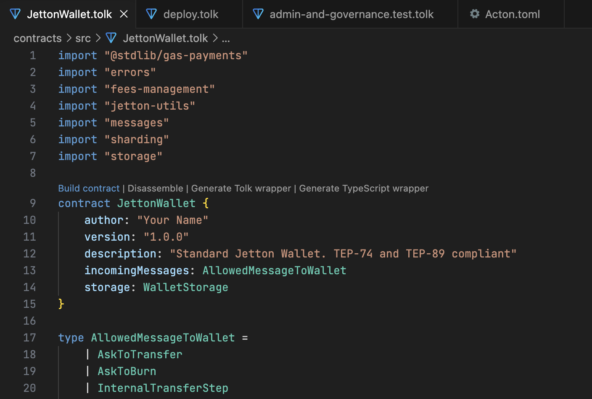

## Disassembly

The extension can open an assembly preview for a Tolk contract, making it easier to inspect the
compiled code without leaving the editor.

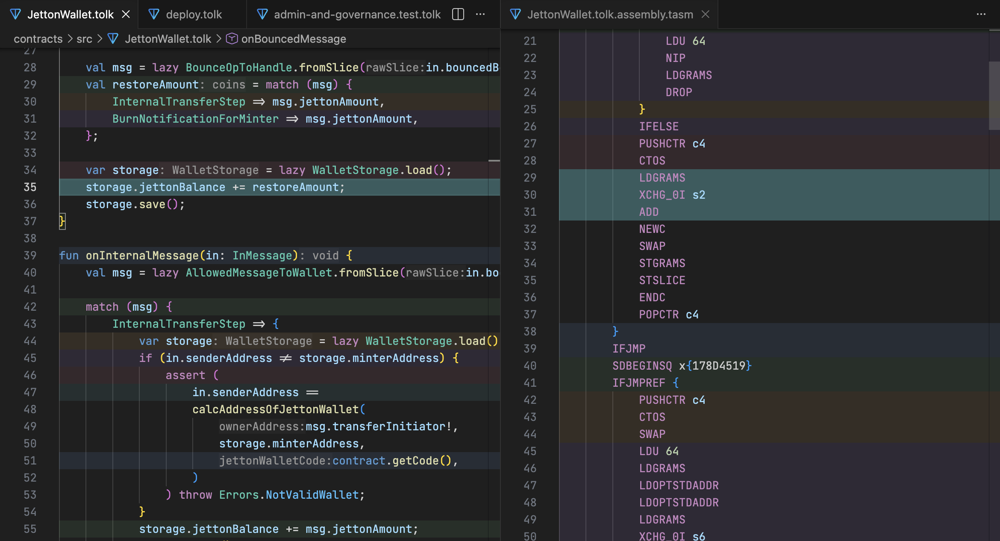

## Testing

### Native test runner

Acton tests integrate with the IDE's native test runner, providing a hierarchical view and progress indicators.

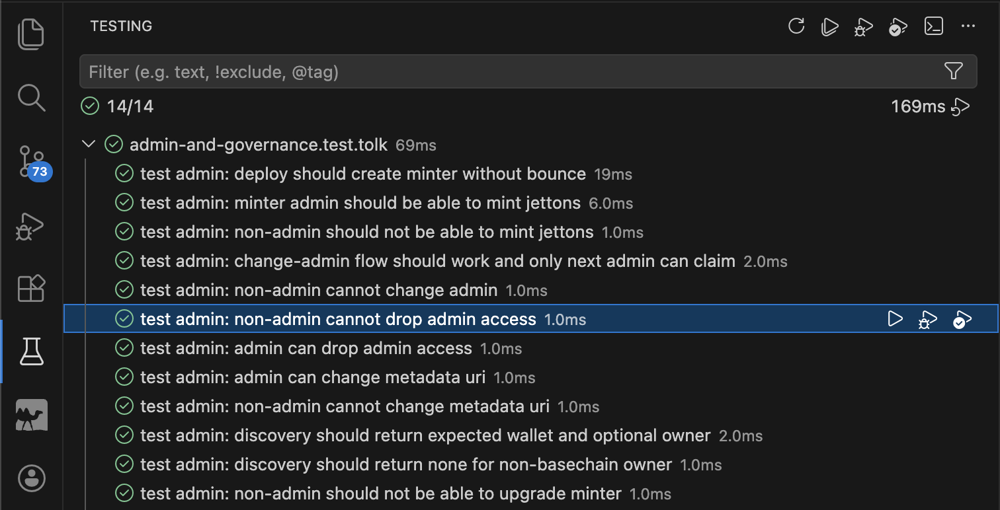
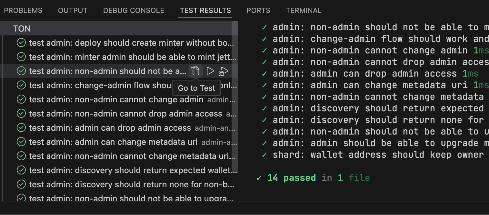

For convenient execution, the plugin provides a test run icon in the editor.

### Failure analysis

When a test fails, the plugin highlights the specific `expect` call that failed and changes the test icon.

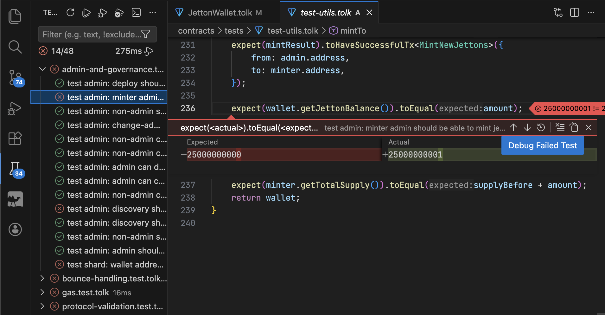

### Debugging

Set breakpoints in Tolk tests and contracts, start
debugging from the editor, and inspect stack frames, local values, and TVM registers.

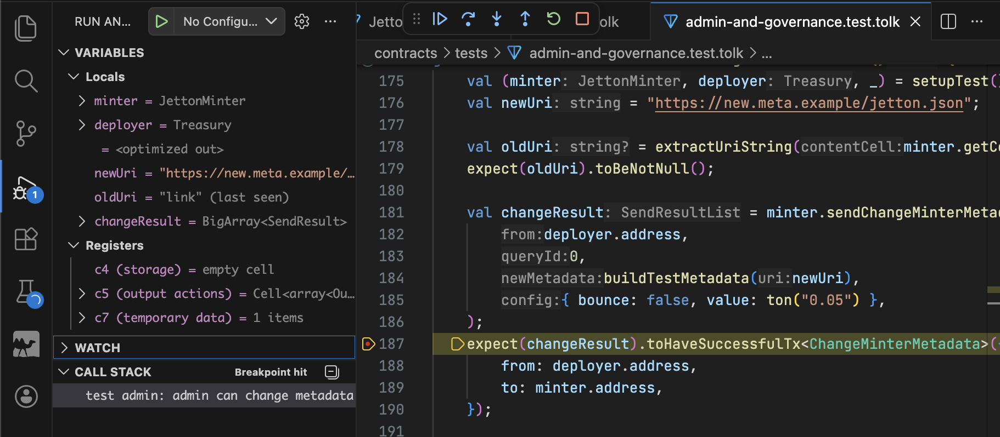

### Code coverage

Coverage results are displayed in the editor gutter and file tree, showing which contract lines were executed during tests.

### Test snippets

The `test` live template allows generating test structures by typing `test` and pressing Tab.

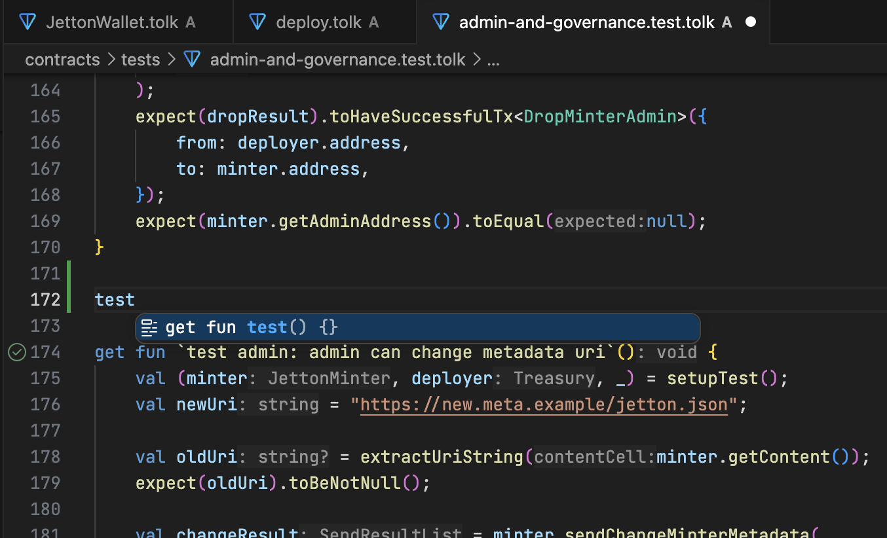

## Toolchain Integration

### Wallet management

The Wallets View allows managing project wallets, including generation, import via mnemonic, balance tracking, and testnet TON requests.

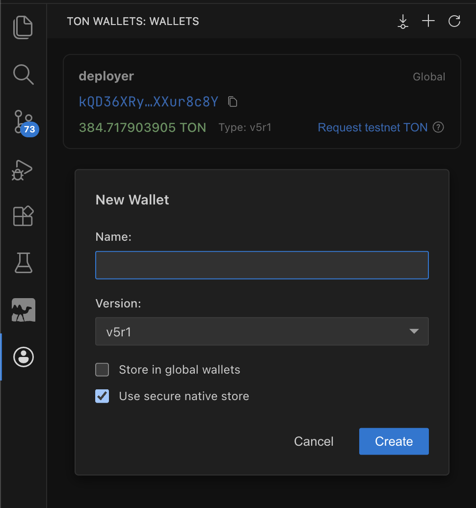

### Script execution

Scripts can be executed via code lenses:

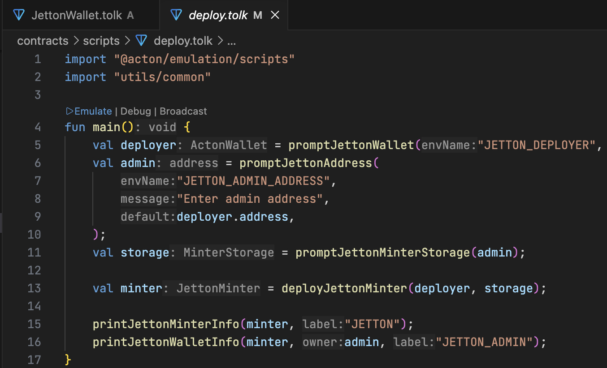

### Terminal links

TON addresses in Acton terminal output are converted into clickable links that open the configured
block explorer.

### Linting

The extension runs `acton check` for Tolk files and reports diagnostics directly in the editor.
Available fixes can be applied from the Problems panel or the inline quick-fix menu.

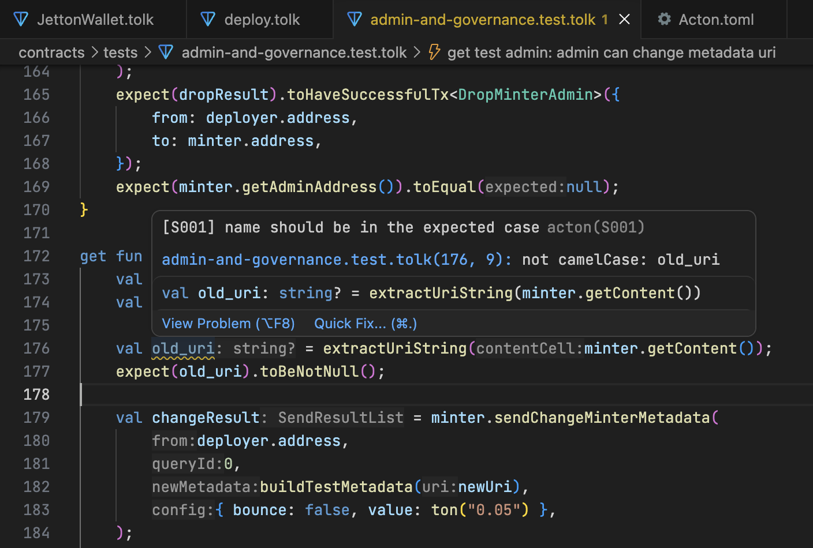
