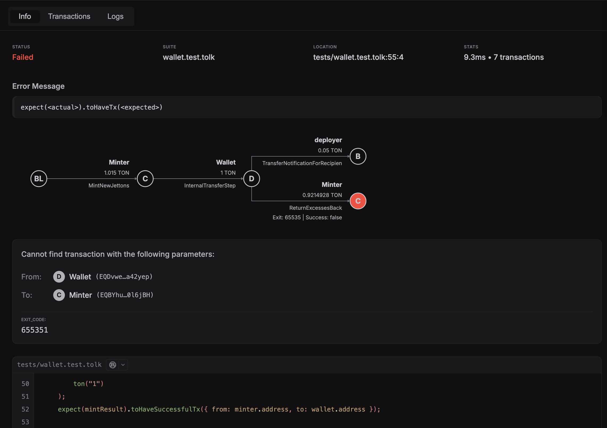

This quickstart shows how to go from `acton test --ui` to diagnosing a failed test.

## 1. Run tests with UI

```bash
acton test --ui
```

Useful variants:

```bash
# Choose a custom UI port
acton test --ui --ui-port 23456

# Run only selected tests
acton test tests/counter.test.tolk --ui --filter "test-deploy"
```

## 2. Open failed test first

In the left sidebar:

- filter by `Failed`
- click the failed test
- open `Info` tab

In `Info` tab, check:

- error message and matcher context
- source location (`file:line:column`)
- fee summary per trace



## 3. Inspect execution graph

Open `Transactions` tab:

- select trace (if multiple)
- inspect transaction tree and failed nodes
- click node to open detailed phase/fee/exit-code panel


## 4. Inspect VM logs

Open `Logs` tab:

- `Executor Log` for high-level execution flow
- `VM Log` for low-level VM details

## Common issues

- UI server did not start: selected port may be busy; try `--ui-port 23456`.
