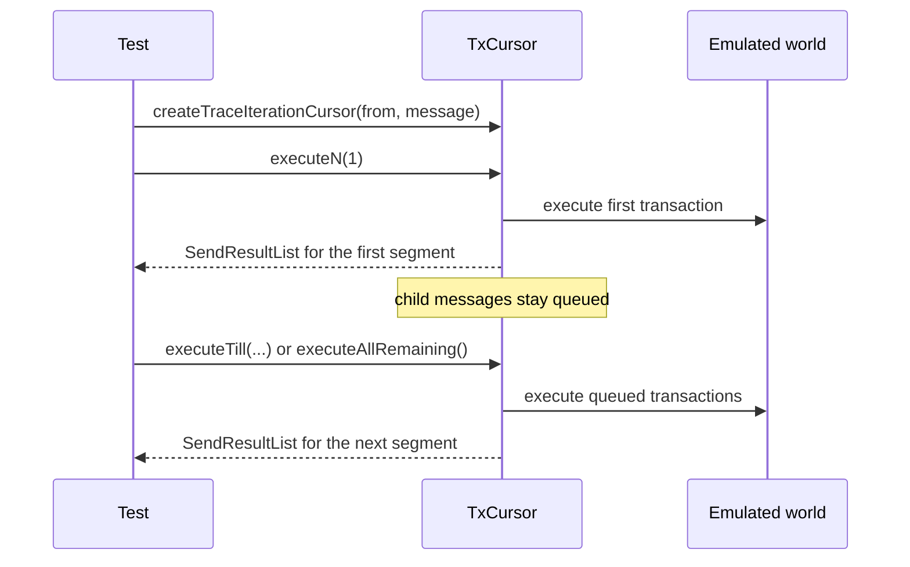
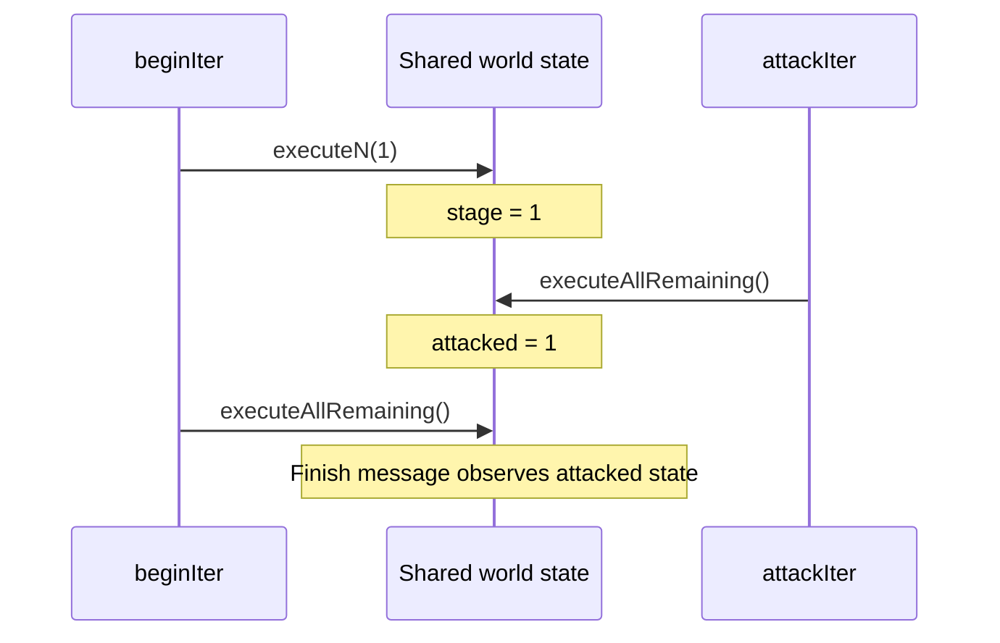

The [`net.send()`](/docs/standard_library/emulation/network#netsend) function eagerly executes the whole transaction chain produced by a message. That is the right default for most tests.

Alternatively, use [`testing.createTraceIterationCursor()`](/docs/standard_library/emulation/testing#testingcreatetraceiterationcursor) when later hops must run under explicit control:

- Inspect the first few transactions of a long cascade.
- Assert intermediate state before downstream messages run.
- Interleave two independent message chains against the same emulated world.
- Discard the remaining tail intentionally.

<Callout type="idea">
    Prefer [`net.send()`](/docs/standard_library/emulation/network#netsend) unless partial execution is required. It keeps tests shorter and more readable.
</Callout>

Import `@acton/emulation/testing` in test files that use the cursor APIs from the `testing` namespace.

```tolk
import "@acton/emulation/testing"
```

## Mental model

[`testing.createTraceIterationCursor(from, message)`](/docs/standard_library/emulation/testing#testingcreatetraceiterationcursor) starts a cursor for one root message and returns a [`TxCursor`](/docs/standard_library/emulation/testing#txcursor).

```tolk
val iter = testing.createTraceIterationCursor(sender.address, msg);
```

The cursor owns the pending tail of that message chain. Every `execute...()` call:

- runs the next part of the chain;
- mutates the same emulated blockchain state;
- returns only the newly executed segment as `SendResultList`.



The main cursor methods are:

- [`executeN(n)`](/docs/standard_library/emulation/testing#txcursorexecuten) — execute up to `n` transactions
- [`executeTill<Msg>(params)`](/docs/standard_library/emulation/testing#txcursorexecutetill) — execute until a matching transaction is reached
- [`executeAllRemaining()`](/docs/standard_library/emulation/testing#txcursorexecuteallremaining) — execute everything that is still pending
- [`isDone()`](/docs/standard_library/emulation/testing#txcursorisdone) — check whether the cursor has no more pending transactions
- [`close()`](/docs/standard_library/emulation/testing#txcursorclose) — discard the remaining tail

## Execute the first hop, then drain the rest

Suppose a contract forwards a message and the state should be checked between the first and second hop:

```tolk
val forwardMessage = createMessage({
    bounce: false,
    value: ton("0.5"),
    dest: forwarderAddress,
    body: TriggerForward {
        queryId: 7,
        target: receiverAddress,
    },
});

val iter = testing.createTraceIterationCursor(sender.address, forwardMessage);

val first = iter.executeN(1);
expect(first).toHaveLength(1);
expect(first).toHaveSuccessfulTx<TriggerForward>({
    from: sender.address,
    to: forwarderAddress,
});

// The forwarded message has not been processed yet.
expect(net.runGetMethod<int>(receiverAddress, "received")).toEqual(0);
expect(iter.isDone()).toBeFalse();

val tail = iter.executeAllRemaining();
expect(tail).toHaveLength(1);
expect(tail).toHaveSuccessfulTx<Notify>({
    from: forwarderAddress,
    to: receiverAddress,
});
expect(net.runGetMethod<int>(receiverAddress, "received")).toEqual(1);
expect(iter.isDone()).toBeTrue();
```

This is the main difference from [`net.send()`](/docs/standard_library/emulation/network#netsend): after [`executeN(1)`](/docs/standard_library/emulation/testing#txcursorexecuten), the emulator state already reflects the first transaction, while the child message is still queued inside the cursor.

## Stop when a specific hop appears

Use [`executeTill<Msg>(...)`](/docs/standard_library/emulation/testing#txcursorexecutetill) to run a chain until a matching transaction appears:

```tolk
val routeMessage = createMessage({
    bounce: false,
    value: ton("0.5"),
    dest: routerAddress,
    body: TriggerRoute {
        queryId: 17,
        relay: relayAddress,
        sink: sinkAddress,
    },
});

val iter = testing.createTraceIterationCursor(sender.address, routeMessage);

val untilRelay = iter.executeTill<Relay>({
    from: routerAddress,
    to: relayAddress,
});

expect(untilRelay).toHaveSuccessfulTx<TriggerRoute>({
    from: sender.address,
    to: routerAddress,
});
expect(untilRelay).toHaveSuccessfulTx<Relay>({
    from: routerAddress,
    to: relayAddress,
});

// The rest of the chain is still pending.
expect(iter.isDone()).toBeFalse();
```

The matching transaction is included in the returned segment.

When the generic message type is supplied, Acton fills the opcode slice of the search from that type. Narrow the match further with regular [`SearchParams`](/docs/standard_library/emulation/network#searchparams) filters.

If no matching transaction is found before the queue is exhausted, [`executeTill()`](/docs/standard_library/emulation/testing#txcursorexecutetill) fails the test.

## Interleave two message chains

Each [`testing.createTraceIterationCursor()`](/docs/standard_library/emulation/testing#testingcreatetraceiterationcursor) call returns its own cursor, so two independent chains can interleave on shared world state.

```tolk
val beginMessage = createMessage({
    bounce: false,
    value: ton("0.5"),
    dest: raceAddress,
    body: Begin { queryId: 1 },
});

val attackMessage = createMessage({
    bounce: false,
    value: ton("0.5"),
    dest: raceAddress,
    body: Attack { queryId: 2 },
});

val beginIter = testing.createTraceIterationCursor(sender.address, beginMessage);
val attackIter = testing.createTraceIterationCursor(attacker.address, attackMessage);

val beginFirst = beginIter.executeN(1);
expect(beginFirst).toHaveSuccessfulTx<Begin>({
    from: sender.address,
    to: raceAddress,
});
expect(net.runGetMethod<int>(raceAddress, "stage")).toEqual(1);

val attackAll = attackIter.executeAllRemaining();
expect(attackAll).toHaveSuccessfulTx<Attack>({
    from: attacker.address,
    to: raceAddress,
});
expect(net.runGetMethod<int>(raceAddress, "attacked")).toEqual(1);

val beginTail = beginIter.executeAllRemaining();
expect(beginTail).toHaveSuccessfulTx<Finish>({
    from: raceAddress,
    to: raceAddress,
});
expect(beginTail.at(0).parentLt).toEqual(beginFirst.at(0).tx.load().lt);
```

In the example above, `beginIter.executeN(1)` sets `stage`, then `attackIter.executeAllRemaining()` runs against that updated state and sets `attacked`. When `beginIter` resumes, both changes are already visible:



This pattern is useful for race conditions, ordering-sensitive flows, and "message in the middle" scenarios.

## Discard the remaining tail

Use [`close()`](/docs/standard_library/emulation/testing#txcursorclose) when the rest of the chain is irrelevant to the test and the pending tail should be dropped:

```tolk
val forwardMessage = createMessage({
    bounce: false,
    value: ton("0.5"),
    dest: forwarderAddress,
    body: TriggerForward {
        queryId: 88,
        target: receiverAddress,
    },
});

val iter = testing.createTraceIterationCursor(sender.address, forwardMessage);

val first = iter.executeN(1);
expect(first).toHaveLength(1);

iter.close();
expect(iter.isDone()).toBeTrue();
expect(iter.executeAllRemaining()).toBeEmpty();
```

Closing the cursor discards any pending internal tail that has not been executed yet.

## Shape of the return

Every `execute...()` call returns the same result shape as [`net.send()`](/docs/standard_library/emulation/network#netsend): a [`SendResultList`](/docs/standard_library/emulation/network#sendresultlist).

That means the usual tools still apply:

- transaction matchers such as [`toHaveTx()`](/docs/standard_library/emulation/network#expectationsendresultlisttohavetx) and [`toHaveSuccessfulTx()`](/docs/standard_library/emulation/network#expectationsendresultlisttohavesuccessfultx)
- direct access to `tx`, `parentLt`, `childTxs`, `outMessages`, and `externals`
- `println(segment)` to inspect the executed batch in the terminal

The same layout also supports splitting one scenario into several assertions without a separate assertion API for partial runs.

## Limits and caveats

- [`testing.createTraceIterationCursor()`](/docs/standard_library/emulation/testing#testingcreatetraceiterationcursor) is available only in emulation mode. It is not a broadcast workflow.
- [`executeN(0)`](/docs/standard_library/emulation/testing#txcursorexecuten) is a no-op and leaves the cursor untouched.
- [`executeTill()`](/docs/standard_library/emulation/testing#txcursorexecutetill) fails if the queue is exhausted before a match is found.
- [`close()`](/docs/standard_library/emulation/testing#txcursorclose) discards pending work; it does not roll the state back.

For rollback or checkpoints together with partial execution, combine [`testing.createTraceIterationCursor()`](/docs/standard_library/emulation/testing#testingcreatetraceiterationcursor) with [`testing.saveSnapshot()`](/docs/standard_library/emulation/testing#testingsavesnapshot) and [`testing.loadSnapshot()`](/docs/standard_library/emulation/testing#testingloadsnapshot), or see [world state snapshots](/docs/testing/world-state-snapshots).

## See also

- [Reading transaction chains](/docs/testing/reading-transaction-chains)
- [`@acton/emulation/network` reference](/docs/standard_library/emulation/network)
