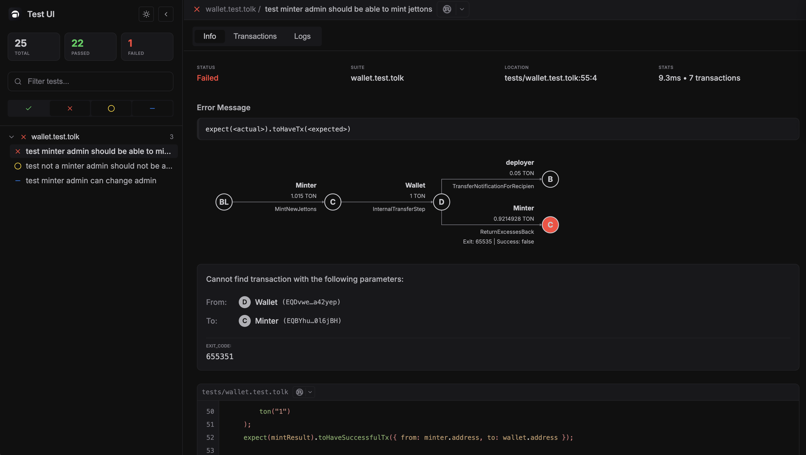
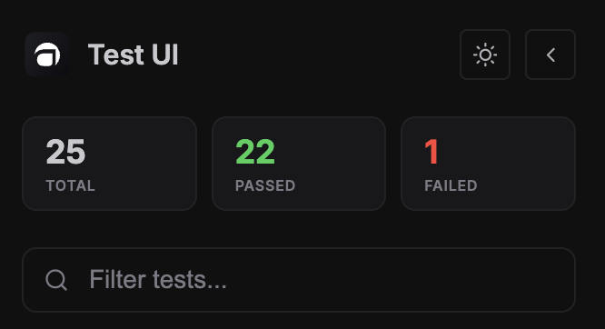
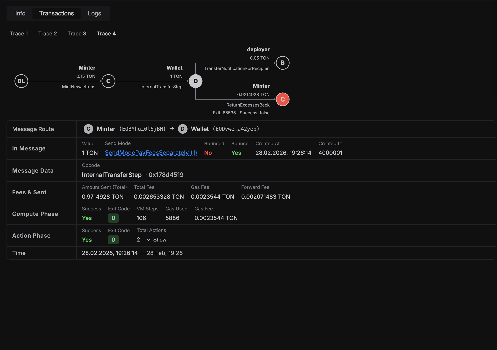
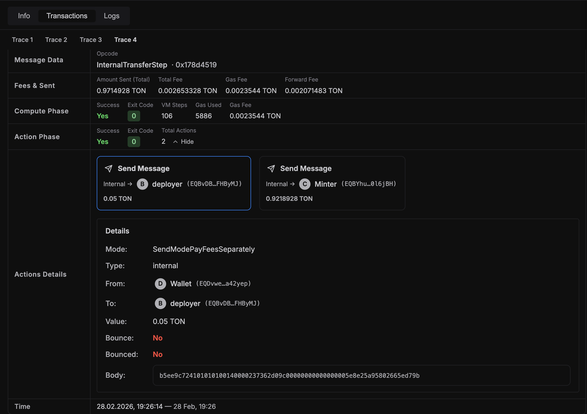

Test UI is a browser interface for reviewing completed `acton test` runs with traces, transaction trees, logs, source links, and coverage data when the run includes `--coverage`.

## 1. Start Test UI

```bash
# Run tests and open Test UI in browser
acton test --ui
```

Useful options:

```bash
# Custom UI port
acton test --ui --ui-port 23456

# Run only selected tests in UI
acton test tests/counter.test.tolk --ui --filter "test deploy"

# Open Test UI with coverage viewer enabled
acton test --coverage --ui
```


<Callout type="warn">
  If `--ui-port` is already in use, Test UI server cannot start. Choose another
  free port, for example `--ui-port 23456`.
</Callout>

<Callout type="tip">
  The `Coverage` tab is available only when the test run is started with both
  `--coverage` and `--ui`.
</Callout>

## 2. Sidebar features

### Test search and status filters

- Text filter (`Filter tests...`) matches test names
- Status toggles for all statuses: `Passed`, `Failed`, `Skipped`, `Todo`

Both can be used simultaneously.

### Suite and test navigation

- Tests are grouped by files
- Each suite can be collapsed/expanded
- Suite row shows number of visible tests
- Suite status icon highlights failed suites
- Clicking a test opens full details on the right



### Sidebar controls

- Theme toggle (`light`/`dark`)
- Collapse sidebar button



## 3. Test header and IDE integration

The selected test header contains:

- test status icon
- suite and test names
- quick-open button for current IDE
- IDE selector dropdown

Supported IDE deep links include Cursor, VS Code-family, and JetBrains IDEs.

### Keyboard shortcuts

- `.` opens current test location in selected IDE
- `Esc` closes IDE dropdowns


## 4. Info tab

The `Info` tab includes:

- test status
- suite name
- file location (`file:line:column`)
- duration and total transaction count

### Failure diagnostics

For failed tests, Info tab also shows:

- error message block
- detailed matcher/exit-code message
- structured mismatch context for transaction assertions (`from`, `to`, and matcher params)
- failed transaction tree (if available)
- highlighted source snippet around failure location


### Fee summary

If traces are available, Info tab also shows `Fee Summary` table per trace:

- trace name
- transaction count
- gas used
- total fee

Clicking a trace row opens that trace in `Transactions` tab.

For baseline and regression-oriented fee analysis, see the [gas profiling with snapshots](/docs/testing/gas-profiling-with-snapshots) page.

<Callout type="tip">
  Name trace chains in tests with [`txs.giveName(...)`](/docs/standard_library/emulation/network#sendresultlistgivename) to make trace tabs and fee summaries easier to read.
</Callout>


## 5. Transactions tab

If a test has trace data, Transactions tab provides full tree visualization.

### Trace switcher

- When a test has multiple traces, tabs appear above content
- Selecting a trace updates tree and details

### Transaction tree

- Horizontal transaction tree with root blockchain node
- Node color indicates success/failure
- Dashed edges indicate bounced messages
- Hover tooltip shows route, state transition, and gas/exit-code details

### Transaction details panel

Clicking a node opens detailed transaction view below tree:

- message route (`from -> to`) and message metadata
- opcode info with ABI name (when available)
- fee breakdown and compute/action phase status
- exit code details and quick copy controls



### Actions details

When action phase has out actions:

- action cards are shown (`sendMsg`, `reserve`, `setCode`)
- failed actions are marked with `Failed` badge
- expanded action details include destination, payload, mode decoding, and failure reason



## 6. Logs tab

Logs tab shows `Executor Log` and `VM Log` grouped by transaction for the selected trace. If a transaction has no logs, it is skipped; if all VM logs are missing for the selected trace, UI shows a hint to rerun with `acton test --ui --verbose`.


## 7. Coverage tab

When the run includes `acton test --coverage --ui`, Test UI adds a dedicated
`Coverage` tab with:

- summary cards for overall coverage
- file list sorted by coverage score
- source viewer with annotated covered and uncovered lines
- search field for filtering files

The `Coverage` tab supports a quick visual scan of uncovered lines without leaving the browser UI.
