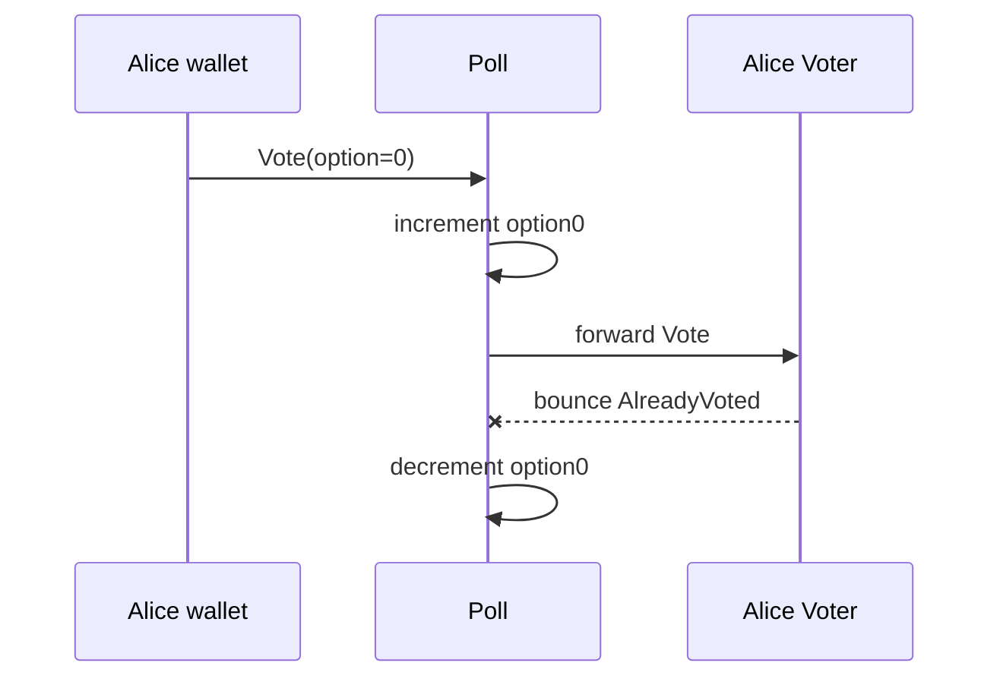

## How bounced messages work

When a bounceable message fails on the recipient:

1. The TVM creates a bounced message with the prefix `0xFFFFFFFF` followed by the first 256 bits of the original body.
2. That bounced message goes back to the original sender (Poll).
3. Poll's `onBouncedMessage` handler is called.

The 256-bit limit matters: the `Vote` struct is 40 bits (32-bit opcode + 8-bit option), so it fits entirely in the bounce payload. That is why `BounceMode.Only256BitsOfBody` is used when Poll forwards a `Vote` to Voter.



## Implement `onBouncedMessage` in Poll

In `contracts/Poll.tolk`, replace the empty `onBouncedMessage` with:

```tolk title="contracts/Poll.tolk"
fun onBouncedMessage(in: InMessageBounced) {
    in.bouncedBody.skipBouncedPrefix();
    val msg = lazy Vote.fromSlice(in.bouncedBody);

    var storage = lazy PollStorage.load();
    if (msg.option == 0) {
        storage.option0 -= 1;
    } else {
        storage.option1 -= 1;
    }
    storage.save();
}
```

`skipBouncedPrefix()` discards the 32-bit `0xFFFFFFFF` bounce marker. After that, the remaining body is the original `Vote` message, so it parses normally with `Vote.fromSlice`.

The handler undoes the optimistic increment from `onInternalMessage`.

## Run all tests

```bash
acton test
```

```acton-cli noCopy title="terminal"
$ acton test
   Compiling contracts
    Finished in 608.91µs
     Running tests

 TEST  <root>/poll

 > tests/poll.test.tolk (3 tests)
  ✓ alice votes option 0  19ms
  ✓ alice and bob vote for different options  23ms
  ✓ alice cannot vote twice  21ms

 ✓ 3 passed in 1 file
```

All three tests pass. Open the Test UI and inspect the "alice cannot vote twice" trace:

1. First vote: `alice → Poll → Voter` — all green
2. Second vote: `alice → Poll` (count goes to 2) → `Poll → Voter` (Voter throws) → bounce → Poll decrements back to 1

## Run coverage analysis

```bash
acton test --coverage
```

```acton-cli noCopy title="terminal"
$ acton test --coverage
   Compiling contracts
    Finished in 611.29µs
     Running tests

 TEST  <root>/poll

 > tests/poll.test.tolk (3 tests)
  ✓ alice votes option 0  19ms
  ✓ alice and bob vote for different options  23ms
  ✓ alice cannot vote twice  21ms

 ✓ 3 passed in 1 file

──────────────────────────────────────────────────────────────────────────────────────────────
 File         Covered   Total Lines   % Lines   Covered   Total Branches   % Branches   Score
──────────────────────────────────────────────────────────────────────────────────────────────
 All files         40            44     90.9%        17               24        70.8%    83.8%
 Voter.tolk         8             9     88.9%         5                8        62.5%    76.5%
 Poll.tolk         30            33     90.9%        12               16        75.0%    85.7%
 types.tolk         2             2    100.0%         0                0          n/a   100.0%
```

<Callout type="info">
  Exact coverage numbers vary. The goal is to identify uncovered lines.
</Callout>

Likely gaps:

- The `option == 1` branch in `onBouncedMessage` — only tested with `option == 0`
- The `Errors.NotFromPoll` path in Voter — no test sends a `Vote` directly to Voter

Add two tests to fill those gaps:

```tolk title="tests/poll.test.tolk"
get fun `test bounce on option 1 vote`() {
    val (poll, _, alice, _) = setupTest();

    val res1 = poll.sendVote(alice.address, 1, { value: grams("0.1") });
    expect(res1).toHaveAllSuccessfulTxs();

    poll.sendVote(alice.address, 1, { value: grams("0.1") });
    val (_, opt1) = poll.results();
    expect(opt1).toEqual(1);
}

get fun `test voter rejects direct vote`() {
    val (poll, _, alice, _) = setupTest();
    val intruder = testing.treasury("intruder");

    // Deploy the Voter by having Alice vote normally first.
    val voteRes = poll.sendVote(alice.address, 0, { value: grams("0.1") });
    expect(voteRes).toHaveAllSuccessfulTxs();

    val voterAddr = poll.calcVoterAddress(alice.address);
    val voter     = Voter.fromAddress(voterAddr);

    val directMsg = createMessage({
        bounce: false,
        value:  grams("0.05"),
        dest:   voter.address,
        body:   Vote { option: 0 },
    });
    val res = net.send(intruder.address, directMsg);
    expect(res).toHaveFailedTx({
        from:     intruder.address,
        to:       voter.address,
        exitCode: Errors.NotFromPoll,
    });
}
```

And add an import for the Voter contract wrapper on top:

```tolk title="tests/poll.test.tolk"
import "@wrappers/Voter.gen"
```

Run coverage again — coverage should be above 90% for both contracts.

## Checkpoint

All tests pass and coverage is above 90%. Poll correctly handles the full vote lifecycle, including duplicate votes that bounce and revert. The bounce mechanism acts as an asynchronous callback from Voter to Poll.

**Commands introduced:** `acton test --coverage`, `acton wrapper`
