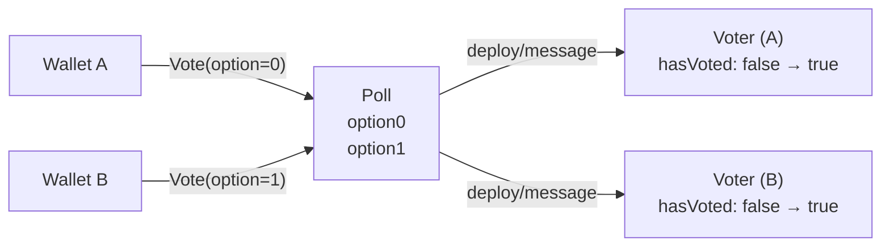

## The obvious design

A poll needs to:

1. Accept a `Vote` message from any wallet
2. Check whether that wallet has voted before
3. If not, count the vote and record the wallet

The first instinct is to keep everything in one contract, using a dictionary (hashmap) stored in the contract's persistent data:

```tolk
struct PollStorage {
    owner:    address
    option0:  uint32
    option1:  uint32
    voters:   map<address, bool>
}
```

On each `Vote`, look up the sender in the map. If absent, add them and increment the count:

```tolk
var storage = lazy PollStorage.load();
assert (msg.option == 0 || msg.option == 1) throw Errors.InvalidOption;

val alreadyVoted = storage.voters.exists(in.senderAddress);
assert (!alreadyVoted) throw Errors.AlreadyVoted;

storage.voters.set(in.senderAddress, true);
if (msg.option == 0) {
    storage.option0 += 1;
} else {
    storage.option1 += 1;
}
storage.save();
```

With a small number of voters it works correctly.

## The wall

TON contracts store persistent data in a cell tree. A single cell holds at most **1023 bits** and up to **4 references**. While the TVM lazily traverses this tree via cell references rather than loading the entire state into memory, there is a hard limit: a single contract's persistent state is capped at **65,536** unique cells.

Furthermore, as TON documentation explicitly warns:

> Every map that is expected to grow beyond 1,000 values is dangerous. In the TVM map, key access is asymptotically logarithmic, meaning that gas consumption continuously increases to find keys as the map grows.

Because of this, storing an `address → bool` entry per voter in a single contract is a fatal architectural flaw. It will rapidly hit the hard 65k cell ceiling, and even before that, gas costs for updating and querying the dictionary will soar, rendering the contract economically unviable long before a popular poll ends.

More fundamentally: **TON itself shards**. Different contracts run in parallel on different shards. A single contract holding all voter state becomes a sequential bottleneck — every vote is a write to the same storage.

## The target architecture

The canonical solution on TON is per-user contracts. Instead of one large map, deploy a tiny `Voter` contract per wallet address. The parent `Poll` counts votes — it never stores who voted. Each `Voter` tracks whether its owner has already voted. This pattern is called **sharding** and appears everywhere on TON — Jetton wallets, NFT items, and more.



- `Poll` holds two counters only: `option0` and `option1`
- On each `Vote`, `Poll` deploys or messages a `Voter` contract at the deterministic address derived from the sender's wallet
- `Voter` rejects duplicate votes by throwing an error, which bounces the message back to `Poll`
- `Poll`'s `onBouncedMessage` reverts the count increment

The next two pages implement this: first the contracts, then the tests that prove it works.
