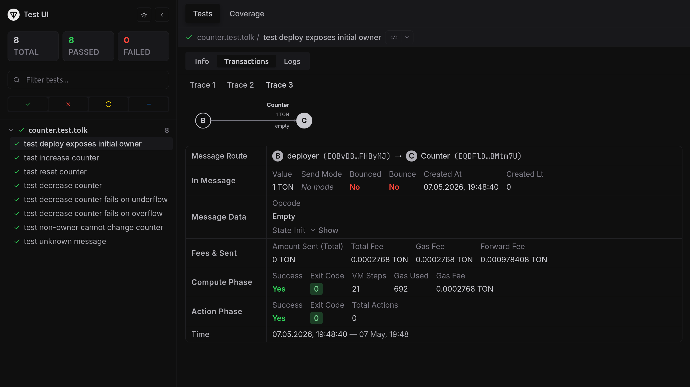
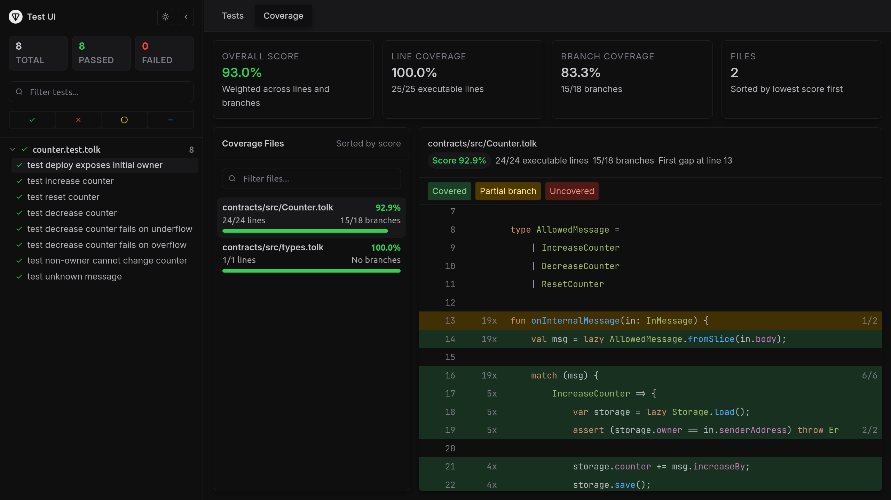
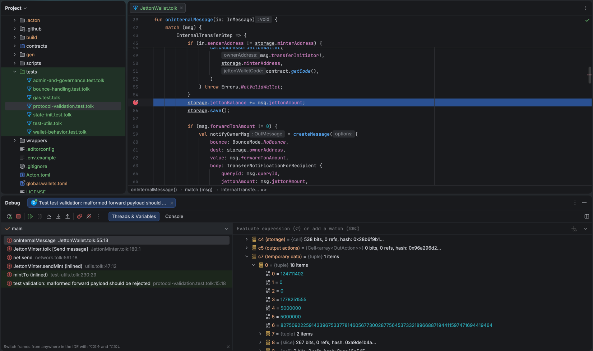

This guide covers the full Acton workflow: creating a counter contract from a template, compiling it, linting and formatting code, running tests with coverage and mutation analysis, setting up a wallet, deploying to testnet, and verifying the source.

## Prerequisites

- [Acton](/docs/installation) {{ acton_version }} or later installed.
- [Node.js](https://nodejs.org/en/download/) 22 or later LTS: required for the TypeScript app scaffold added by `--app`.

To enable Acton support in the IDE, install either of:

- [TON VS Code extension](/docs/ide-support/vscode)
- [TON JetBrains IDE plugin](/docs/ide-support/jetbrains)

To enhance agentic workflows, [install Acton development skills](/docs/agent-skills/overview).

## Initialize a new project

<Callout>
    Finished the [quickstart](/docs/quickstart)? Skip the project creation step and continue reading this guide.
</Callout>

Use [`acton new`](/docs/commands/new) to create a new project directory from a built-in template:

- The `counter` template ships with a ready-made contract, tests, and a deployment script.
- The `--app` flag adds a Vite-based React frontend scaffold and generated TypeScript wrappers alongside the Tolk sources.

```bash
acton new first_counter --template counter --app
```

Output:

```acton-cli noCopy title="terminal"
$ acton new first_counter --template counter --app
  Installing standard library v{{ acton_version }}
> Initialized empty Git repository in /home/you/first_counter/.git/
✓ Created new Acton project
  Project name: first_counter
  Description: A TON blockchain project
  Template: counter
  TypeScript app: included
  License: MIT

Created Acton.toml with project configuration
```

<Callout type="idea">
  Pass `--hooks` to install pre-commit checks, or `--agents` to add coding-agent guidance. See [`acton new`](/docs/commands/new) for all options. When run without arguments, `acton new` prompts interactively.
</Callout>

Navigate to the project folder:

```bash
cd first_counter
```

With `--app`, the project layout places Tolk sources under `contracts/src/`, tests under `contracts/tests/`, and scripts under `contracts/scripts/`. Generated TypeScript wrappers go into `wrappers-ts/`, and the React frontend lives in `app/`.

Install the NPM workspace dependencies before running any frontend commands:

```bash
npm ci
```

The generated `Acton.toml` includes ready-to-run script aliases `deploy-emulation` and `deploy-testnet`. Start with local emulation; it does not require a wallet, a network connection, or testnet funds.

```bash
acton run deploy-emulation
```

If [`acton wallet`](/docs/commands/wallet) is already configured, the contract can be deployed to testnet immediately.

```bash
acton run deploy-testnet
```

Output:

```acton-cli-trace noCopy title="terminal"
$ acton run deploy-testnet
acton script contracts/scripts/deploy.tolk --net testnet
Awaiting trace... [Attempt 1/20]
Trace settled with 2 transaction(s)
N/A -> external
└── ext-in 0x7369676e -> EQD36X..ur8XSS A      gas=4939
    └── empty 0.005 GRAM -> EQBoxX..16Bfkg B    gas=692

Deployed counter to kQD...tVe (Counter)
Counter owner is kQB...iD (deployer)
Counter value is 0
```

## Build the contract

Use [`acton build`](/docs/commands/build) to compile every contract configured in `Acton.toml` and place build artifacts in `build/` folder:

```bash
acton build
```

Output:

```acton-cli noCopy title="terminal"
$ acton build
   Compiling contracts
   Compiling Counter
    Finished in 4.8ms
    Finished in 728.8µs
```

Each compiled contract produces a JSON artifact:

```json title="build/Counter.json"
{
  "code_boc64": "te6ccgEBBwEA1gABFP8A9KQT9Lzy...",
  "hash": "15407004A66E0CF95A67C39EDBB54A531DFDB6DF93FB7D365FAE57A34B874747"
}
```

Build a single contract by name:

```bash
acton build Counter
```

<Callout type="idea">
    Pass `--info` to print artifact details, or `--clear-cache` to discard cached artifacts and recompile from scratch. See [`acton build`](/docs/commands/build) for all options.
</Callout>

Print artifact details and resolved build output:

```bash
acton build --info
```

Output:

```acton-cli noCopy title="terminal"
$ acton build --info
   Compiling contracts
    Finished in 2.7ms

   Artifacts of Counter
        Code te6ccgEBBwEA1gABFP8A9KQT9LzyyAsBAgFiAgMB+ND4...
        Hash 0x15407004A66E0CF95A67C39EDBB54A531DFDB6DF93FB7D365FAE57A34B874747
```

See the [building guides](/docs/building/overview) for more.

## Format Tolk files

Use [`acton fmt`](/docs/commands/fmt) to format all `.tolk` files under the project root using the built-in Tolk formatter:

```bash
acton fmt
```

Output:

```acton-cli noCopy title="terminal"
$ acton fmt
All files are already formatted
```

Run in check mode to detect formatting violations without rewriting files:

```bash
acton fmt --check
```

When a file is not formatted correctly, `--check` prints a unified diff and exits with a non-zero status:

```acton-cli noCopy title="terminal"
$ acton fmt --check
Diff in contracts/src/Counter.tolk:
-fun onInternalMessage(in:InMessage){
-val x=1;
+fun onInternalMessage(in: InMessage) {
+    val x = 1;
     val y = 2;
 }
```

Format a specific file or directory:

```bash
acton fmt contracts/src/Counter.tolk
```

See the [formatting guide](/docs/format) for more.

## Lint contracts

Use [`acton check`](/docs/commands/check) to run the Tolk linter across the whole project and report diagnostics:

```bash
acton check
```

On a clean project, it prints the checked targets and exits with status 0:

```acton-cli-check noCopy title="terminal"
$ acton check
    Checking Counter
    Checking contracts/scripts/deploy.tolk
    Checking contracts/tests/counter.test.tolk
```

When issues are found, output looks like this:

```acton-cli-check noCopy title="terminal"
$ acton check
warning[E001]: variable `x` is unused
  --> contracts/src/Counter.tolk:12:9
   |
12 |     val x = 1;
   |         ^ help: prefix with `_` to silence

1 issue can be fixed automatically, rerun with --fix flag.

Use acton check --explain <CODE> to get detailed explanation of a rule.
For example: acton check --explain E001
```

Check a specific contract by name or file path:

```bash
acton check Counter
```

See the [linting guide](/docs/lint) for more.

## Regenerate wrappers

Wrappers are auto-generated from the contract ABI, so regenerate them whenever the ABI changes. Store wrappers in VCS along with the contract sources.

### Wrappers for tests and scripts

Use [`acton wrapper`](/docs/commands/wrapper) to generate typed Tolk wrappers from the contract's compiler ABI. A prior `acton build` run is not required.

Regenerate wrappers for every contract at once:

```bash
acton wrapper --all
```

Output:

```acton-cli-wrapper noCopy title="terminal"
$ acton wrapper --all
   Generated contracts/wrappers/Counter.gen.tolk
```

Generate the wrapper for a single contract:

```bash
acton wrapper Counter
```

### Wrappers for dApp integration

Pass `--ts` to emit a TypeScript wrapper instead, which the app template consumes from `wrappers-ts/`:

```bash
acton wrapper Counter --ts
```

```acton-cli-wrapper noCopy title="terminal"
$ acton wrapper Counter --ts
   Generated wrappers-ts/Counter.gen.ts
```

See the [dApp development guide](/docs/dapps) for more information about using TypeScript wrappers.

## Test the contract

The template includes several tests for the counter contract. Use [`acton test`](/docs/commands/test) to discover and run all test files matching `*.test.tolk`:

```bash
acton test
```

Output:

```acton-cli noCopy title="terminal"
$ acton test
   Compiling contracts
    Finished in 726.375µs
     Running tests

 TEST  <root>/first_counter

 > contracts/tests/counter.test.tolk (8 tests)
  ✓ deploy exposes initial owner 4ms
  ✓ increase counter 4ms
  ✓ reset counter 3ms
  ✓ decrease counter 4ms
  ✓ decrease counter fails on underflow 3ms
  ✓ decrease counter fails on overflow 3ms
  ✓ non-owner cannot change counter 3ms
  ✓ unknown message 2ms

 ✓ 8 passed in 1 file
```

Other useful `acton test` flags include:

| Flag                | Purpose                                                  |
|---------------------|----------------------------------------------------------|
| `--filter <regex>`  | Run only tests whose name matches the regular expression |
| `--fail-fast`       | Stop after the first failure                             |
| `--save-test-trace` | Write TVM execution traces to `build/traces/`            |

See the [testing guides](/docs/testing/overview) for more.

### Collect coverage

Pass `--coverage` to collect line and branch coverage and print a summary after the run:

```bash
acton test --coverage
```

Set a minimum threshold to fail CI when coverage drops below a target:

```bash
acton test --coverage --coverage-minimum-percent 80
```

### Inspect results in the browser UI

Pass `--ui` to open an interactive browser interface called [Test UI](/docs/testing/test-ui/overview). Combine it with `--coverage` to browse annotated source files in the Coverage tab:

```bash
acton test --ui --coverage
```

Filter tests and inspect the traces:



Inspect the coverage:



### Run mutation testing

Coverage shows which lines ran — not whether the tests would catch a bug on those lines. Mutation testing fills the gap: it makes small, deliberate changes to the contract — for example, replacing `+= 1` with `-= 1` or removing an `assert` — and reruns the suite. If every test still passes against a mutation, that mutation is a **survivor** — the line is exercised but its behavior is not actually verified.

Use `--mutate-contract` to restrict mutations to a single contract:

```bash
acton test --mutate --mutate-contract Counter
```

Output:

```acton-cli-mutate noCopy title="terminal"
$ acton test --mutate --mutate-contract Counter

Mutation Testing
────────────────────────────────────────────────────────────
Session:  ace2c3aae5a827a2
Contract: Counter
Source:   contracts/src/Counter.tolk
Files:    1
Mutants:  6

  ◉ Mutation 1/6 contracts/src/Counter.tolk:18 Replace == with != KILLED
  ◉ Mutation 2/6 contracts/src/Counter.tolk:22 Replace `+=` with `-=` KILLED
  ◉ Mutation 3/6 contracts/src/Counter.tolk:27 Replace >= with > SURVIVED
  ◉ Mutation 4/6 contracts/src/Counter.tolk:28 Replace `true` with `false` KILLED
  ◉ Mutation 5/6 contracts/src/Counter.tolk:30 Remove assert statements KILLED
  ◉ Mutation 6/6 contracts/src/Counter.tolk:33 Remove throw keyword KILLED

    Total mutants        6
  ✓ Killed               5
  ✗ Survived             1
  ! Compile errors       0

  ◆ Mutation Score       83.3%

Survived Mutants
────────────────────────────────────────────────────────────

  ✗ Mutation #3
  Rule:  Replace >= with > [replace_greater_or_equal_with_greater_than]
  at contracts/src/Counter.tolk:27

Diff in contracts/src/Counter.tolk:
             assert (storage.owner == in.senderAddress) throw Errors.NotOwner;
-            assert (storage.counter >= msg.decreaseBy) throw Errors.CounterUnderflow;
+            assert (storage.counter > msg.decreaseBy) throw Errors.CounterUnderflow;
```

Each survivor pinpoints a specific line, rule, and diff. Add a test that exercises the corresponding path and rerun — the mutation will be killed on the next run.

<Callout type="idea">
  Use `--mutation-diff branch` to test only mutations on lines changed since the merge base — useful in CI to skip re-testing stable code. See the [mutation testing docs](/docs/testing/mutation-testing/overview) for details.
</Callout>

## Debug the contract

### Exception tracing

To quickly identify where an exception occurred, pass `--backtrace full` to get source locations for a failure without stepping through:

```bash
acton test --backtrace full
```

The clean counter template passes. The output below shows the kind of source locations Acton prints when a test fails:

```acton-cli-trace noCopy title="terminal"
$ acton test --backtrace full
   Compiling contracts
   Compiling Counter
    Finished in 5.1ms
    Finished in 731.2µs
     Running tests

 TEST  /home/you/first_counter

 > contracts/tests/counter.test.tolk (2 tests)
  ✗ increase counter 12ms
    └─ Error: expect(actual).toHaveSuccessfulTx(expected)
        N/A -> deployer A
        └── IncreaseCounter 0.1 GRAM -> Counter B           gas=1513 exit_code=10 aborted
            ├── Compute phase failed: Dictionary error
            └── at contracts/src/Counter.tolk:42
                   onInternalMessage   at contracts/src/Counter.tolk:18

        Cannot find transaction from deployer A EQBvDB..FHByMJ to Counter B EQANZp..QQ5GsV
        with:
          success=true
          exit_code=0
      └─ at contracts/tests/counter.test.tolk:24
  ✓ reset counter 4ms

 ✓ 1 passed, ✗ 1 failed in 1 file

Some tests failed.
```

### Source-level debugging

For cases where simple error tracing is not enough, Acton ships a source-level debugger that uses the [Debug Adapter Protocol (DAP)](https://microsoft.github.io/debug-adapter-protocol/). It runs the same contract code as production without a separate debug build.

It provides the expected source-level debugging features:

- variables: see every local at the current frame and watch how its value changes between steps.
- lazy objects: `lazy` values are inspectable even when their fields have not been loaded from storage yet.
- stepping: step over, step into, and step out, including across inlined function boundaries.
- breakpoints: set source breakpoints or use **Run to cursor** to advance to a chosen line.
- exception breaks: stop automatically when an uncaught exception is thrown.



The `--debug` flag is available on three commands:

| Command                                          | What gets debugged                                                                                               |
|--------------------------------------------------|------------------------------------------------------------------------------------------------------------------|
| `acton test [path...] --debug`                   | A live local test session for one or more files/directories — combine with `--filter` to narrow down to one test |
| `acton script <path> --debug`                    | A locally executing script                                                                                       |
| `acton retrace <HASH> --contract <NAME> --debug` | Debug a real on-chain transaction                                                                                |

See the [debugging guide](/docs/debug) for more.

### Start a debug session from the editor

Acton works best with the [TON VS Code extension](/docs/ide-support/vscode) and the [TON JetBrains plugin](/docs/ide-support/jetbrains), which ship a Tolk debug adapter type out of the box. Other DAP clients are also supported.

#### JetBrains IDEs

Open a `*.test.tolk` file and use the run-configuration **Debug** button. The plugin starts Acton with `--debug` and attaches automatically: additional launch configuration is not required.

#### VS Code

To start the test run from the editor, right-click a test inside a `*.test.tolk` file and pick **Debug Test** — the TON extension launches an Acton instance with `--debug` and attaches in one step.

To attach to a running Acton session, start Acton with `--debug` on a fixed `--debug-port`:

```bash
acton test contracts/tests/counter.test.tolk --filter "increase counter" --debug --debug-port 4711
```

Output:

```acton-cli noCopy title="terminal"
$ acton test contracts/tests/counter.test.tolk --filter "increase counter" --debug --debug-port 4711
  Compiling contracts
   Finished in 6.2ms
    Running tests

 TEST  /home/you/first_counter

Debugger server listening on 127.0.0.1:4711
 > contracts/tests/counter.test.tolk (1 test)
```

Acton blocks the selected test until a client attaches. Add the following to `.vscode/launch.json`:

```json title=".vscode/launch.json"
{
 "version": "{{ acton_version }}",
 "configurations": [
   {
     "type": "tolk",
     "request": "launch",
     "name": "Attach to Acton debug session",
     "debugServer": 4711
   }
 ]
}
```

Once the terminal shows `Debugger server listening on 127.0.0.1:4711`, open the **Run and Debug** panel, pick **Attach to Acton debug session** from the configuration dropdown, and run it. VS Code connects to the listening port and the test launches under the debugger.

The same configuration works for `acton script --debug` and `acton retrace --debug` — match the `--debug-port` value with the `debugServer` option.

With the editor attached, set breakpoints in `.tolk` sources, and step through code as the test runs.

#### Any DAP client

To attach other DAP clients, run `acton test` with `--debug` on a fixed `--debug-port` and point to it in the client configuration.

## Run scripts

There is no dedicated `acton deploy` command. Instead, contracts are deployed using Tolk scripts.

Use [`acton script`](/docs/commands/script) to deploy contracts on a real network and interact with them. Tolk scripts can also run in the same local emulation environment as tests.

Script emulation is useful for checking contract address derivation, initial state, deployment statuses, and post-deploy getter calls before deploying contracts to a public network.

<Callout>
    See the [scripting guides](/docs/scripting/overview) for more.
</Callout>

For example, add a new script to the `contracts/scripts/` folder to deploy the counter and increase its counter:

```tolk title="contracts/scripts/increase.tolk"
import "@acton/env"
import "@acton/io"
import "@acton/emulation/network"
import "@acton/emulation/scripts"
import "@contracts/types"
import "@wrappers/Counter.gen"

fun counterDeployValue(): coins {
    return env<coins>("COUNTER_DEPLOY_VALUE_NANOS") ?? 5000000;
}

fun explicitCounterAddress(): address? {
    return env("COUNTER_ADDRESS");
}

fun targetCounter(ownerAddress: address): Counter {
    val expected = Counter.fromStorage(Storage {
        id: 0,
        owner: ownerAddress,
        counter: 0,
    });
    val counterAddress = explicitCounterAddress();
    if (counterAddress == null) {
        return expected;
    }
    return Counter {
        address: counterAddress!,
        stateInit: expected.stateInit,
    };
}

fun main() {
    val delta = env<int>("COUNTER_DELTA") ?? 1;
    val deployer = scripts.wallet("deployer");
    val deployValue = counterDeployValue();
    val counterAddress = explicitCounterAddress();
    val counter = targetCounter(deployer.address);
    println("Deploy value: {}", deployValue);
    if (!scripts.isContractDeployed(counter.address)) {
        if (counterAddress != null) {
            println("Counter is not deployed at {}", counter.address);
            return;
        }
        counter.deploy(deployer.address, { value: deployValue }).waitForFirstTransaction();
    }

    println("Increasing counter by {}", delta);
    val res = counter.sendIncreaseCounter(deployer.address, delta);
    res.waitForFirstTransaction();

    println("Counter address: {}", counter.address);
    println("COUNTER_ADDRESS={}", counter.address);
    println("Current counter value: {}", counter.currentCounter());
}
```

To run the script:

```bash
acton script contracts/scripts/increase.tolk
```

Output:

```acton-cli noCopy title="terminal"
$ acton script contracts/scripts/increase.tolk
Deploy value: 5000000
Increasing counter by 1
Counter address: kQD...tVe (Counter)
COUNTER_ADDRESS=kQD...tVe (Counter)
Current counter value: 1
```

This command emulates the script in the local environment. Scripts can also be emulated against a live network state.

### Fork network state locally

`--fork-net` resolves live account and contract state from a network while keeping execution local — no transactions are broadcast:

```bash
acton script contracts/scripts/deploy.tolk --fork-net testnet
```

It is strongly recommended to verify scripts with `--fork-net` before executing them on a real network.

### Run a script against a real network

If the `--net` flag is passed, all messages sent by `net.send()` and `net.sendExternal()` will be applied to the real network. Use this only after configuring a funded wallet and confirming the local emulation path works.

```bash
acton script contracts/scripts/increase.tolk --net testnet
```

See the [deployment guide](/docs/deploy) for more.

### Set up a wallet

Deployment to testnet or mainnet requires a funded wallet. Use [`acton wallet`](/docs/commands/wallet) to create one and request testnet funds in a single step:

```bash
acton wallet new --name deployer --local --airdrop --version v5r1
```

Output:

```acton-cli noCopy title="terminal"
$ acton wallet new --name deployer --local --airdrop --version v5r1

✓ Wallet successfully created and added to wallets.toml
✓ Wallet address is EQB...m6n

✓ The mnemonic is securely stored in your system's keyring.
→ Requesting airdrop for wallet deployer EQB...m6n
→ Fetching PoW challenge...
→ Solving challenge (difficulty: 20 bits)...
✓ Challenge solved in 46.8ms
✓ Your claim has been queued. It will be processed soon.

NOTE: This is a testnet wallet. Testnet GRAM has NO VALUE.

To check wallet balances run acton wallet list --balance.
```

This creates a new wallet and saves its configuration to `wallets.toml` in the project root. By default, Acton stores the mnemonic in the system keyring when secure storage is available.

<Callout type="warn">
    If secure storage is unavailable, or if disabled with `--secure false`, the mnemonic is written to `wallets.toml`. Never commit it to git. Acton adds it to `.gitignore` automatically.
</Callout>

The `--airdrop` flag automatically requests testnet funds from the configured [faucet](/docs/wallets#fund-a-wallet-on-testnet) after the wallet is created.

Other useful `acton wallet` subcommands:

| Command | Purpose |
|---------|---------|
| `acton wallet new --name deployer --local --airdrop --version v5r1` | Create a Wallet V5 R1 wallet and request testnet funds |
| `acton wallet import --name deployer` | Import an existing mnemonic |
| `acton wallet list --balance` | List configured wallets and their on-chain balances |
| `acton wallet airdrop deployer --net testnet` | Request testnet funds for an existing wallet |
| `acton wallet sign deployer --body <hex>` | Sign an external message body without running a script |
| `acton wallet export-mnemonic deployer` | Export the mnemonic interactively |
| `acton wallet remove deployer -y` | Remove a wallet non-interactively |

See the [wallet management](/docs/wallets) guide and the [`acton wallet`](/docs/commands/wallet) reference for more.

### Use TON Connect

Pass `--tonconnect` to connect a wallet through the TON Connect protocol:

```bash
acton script contracts/scripts/deploy.tolk --net testnet --tonconnect
```

Acton saves the TON Connect session to `build/sessions/tonconnect/<network>.json` and reuses it on subsequent runs.

### Debug script execution

Pass `--verbose` to print executor logs:

```bash
acton script contracts/scripts/deploy.tolk --net testnet --verbose
```

Pass `--show-bodies` to print decoded message bodies alongside each transaction in the output.

```bash
acton script contracts/scripts/deploy.tolk --net testnet --verbose --show-bodies
```

## Verify the contract

Use [`acton verify`](/docs/commands/verify) to check that the deployed bytecode matches the local sources. It compiles local sources, uploads them to the verifier backend, collects the required signatures, and submits the verification transaction.

```bash
acton verify Counter --net testnet --address <CONTRACT_ADDRESS>
```

Replace `<CONTRACT_ADDRESS>` with the address from the [deployment step](#run-scripts).

Verification requires a [funded wallet](#set-up-a-wallet). If there is more than one wallet, choose the target wallet when prompted. If there is a single wallet, it will be selected automatically.

Use `--dry-run` to compile and upload sources without consuming funds to send the verification message:

```bash
acton verify Counter --net testnet --address <CONTRACT_ADDRESS> --dry-run
```

Pass `--tonconnect` to approve the final verification transaction through a TON Connect wallet instead of a wallet from `wallets.toml`:

```bash
acton verify Counter --address EQDt7LL... --net mainnet --tonconnect
```

Acton starts a local TON Connect page and opens it in the browser. If the default page port is busy, pass `--tonconnect-port <PORT>`.

See the [verification guide](/docs/verify) for more.

## Manage on-chain libraries

The counter template does not need on-chain libraries, but larger contracts often use them to keep reusable code in a single masterchain account and reference it from many deployments. When a contract dependency in `Acton.toml` uses `kind = "library_ref"`, publish that dependency first with [`acton library`](/docs/commands/library), then build and deploy the contracts that reference it.

Publish a configured contract as a library:

```bash
acton library publish <CONTRACT_NAME> --duration 365d --wallet deployer --net testnet --local
```

Acton compiles the contract, estimates the storage payment for the requested duration, sends the funding transaction, and saves the resulting metadata to `libraries.toml`. After publishing, inspect the library and top it up before storage fees run out. `info` and `topup` use the network saved in the library metadata:

```bash
acton library info <LIBRARY_NAME>
acton library topup <LIBRARY_NAME> --duration 1y --wallet deployer
```

To inspect code that is already on-chain, fetch it by hash:

```bash
acton library fetch <LIBRARY_HASH> --disasm --net testnet
```

See the [on-chain libraries guide](/docs/libraries) for the full publish, fetch, and `library_ref` workflow.

## Miscellaneous AI-friendly commands

In addition to commonly used commands like `acton test`, AI agents can also benefit from special commands that query data, look up reference documentation, or collect diagnostic information.

### Agent skills

Acton provides several development skills for AI agents to help browse the documentation, use commands, maintain the project layout, write idiomatic Tolk code, and run safety checks.

See the [agent skills overview](/docs/agent-skills/overview) for more.

### Inspect remote state

Use [`acton rpc`](/docs/commands/rpc) to query remote blockchain account and contract state via TON Center APIs:

```bash
acton rpc info <CONTRACT_ADDRESS> --net testnet
```

Fetch the latest masterchain block sequence number with `rpc block-number`:

```bash
acton rpc block-number --net testnet
```

Render a transaction trace as a decoded tree with `rpc trace`:

```bash
acton rpc trace <TX_HASH> --net testnet
```

### Look up TVM instructions

Use [`acton doc tvm`](/docs/commands/doc) to look up TVM reference instruction documentation:

```bash
acton doc tvm PUSHINT_8
```

Add `--find` to fuzzy search instruction names and `--description` to also match descriptions, tags, and operands:

```bash
acton doc tvm --find --description "stack push"
```

### Diagnose the environment

Use [`acton doctor`](/docs/commands/doctor) to print a diagnostic report covering resolved paths, manifest status, standard library health, overlay status, native library metadata, and relevant environment variables:

```bash
acton doctor
```

Run this command and fix discovered issues before filing a bug report.

## Next steps

- [Testing guide](/docs/testing/overview) — deep dive into writing comprehensive tests.
- [Acton's Tolk libraries](/docs/standard_library/overview)
- [CLI commands reference](/docs/commands/overview)
- [Linting rules reference](/docs/rules/overview)
